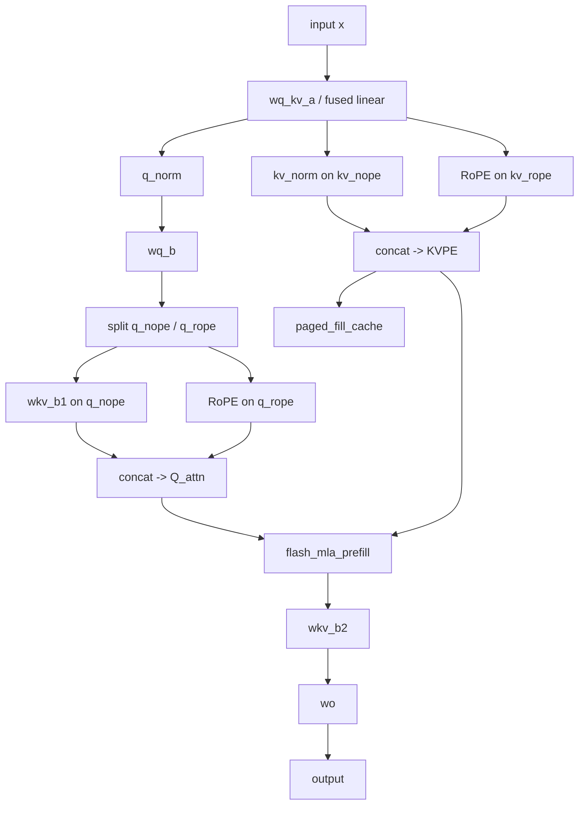
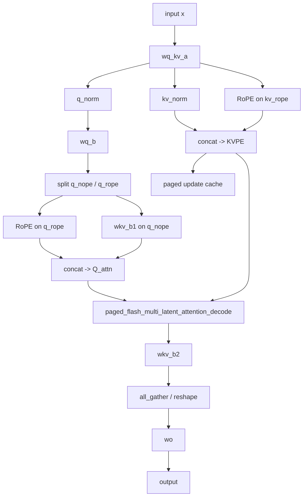
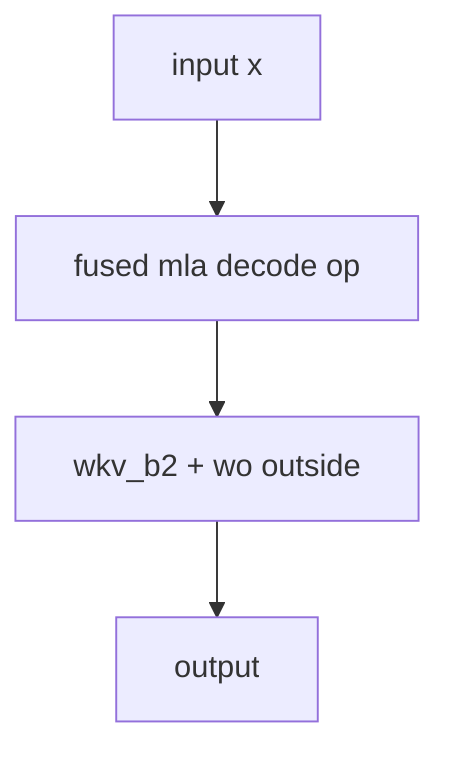

# TT 当前 FlashMLA 执行流程、主栈复用机制与融合算子缺口分析

## 1. 结论先行

先给结论：

1. 当前 `ttnn` 主线里的 `FlashMLA` 不是一个“完整的、端到端融合的 DeepSeek FlashMLA 算子”。
2. 当前主线更准确的形态是：
   - 模型侧先完成 `Q/KV` 的构造、`RoPE`、`RMSNorm`、`KV cache update`
   - attention 本体复用现有 `flash-style SDPA / Flash-Decode` 主栈
   - attention 输出后再做 `wkv_b2 / wo` 等后处理
3. 因此，如果把“完整 FlashMLA”理解成一个融合的 MLA attention operator，那么当前 TT 主线确实还不完整。
4. 但这不等于 TT 没有 MLA。当前 TT 已经有：
   - `MLA-aware SDPA prefill`
   - `MLA-aware SDPA decode`
   - `V-from-K` 的 MLA 读法
   - `paged MLA decode`
5. 仓里其实已经有一个**实验性的 fused FlashMLA decode 种子实现**，在：
   - `models/demos/deepseek_v3_b1/micro_ops/flash_mla/`
   - 以及更大粒度的 `fused_ops/pre_sdpa/`、`fused_ops/attention_block/`
6. 所以，答案不是“能不能做”，而是：
   - **完全可以把当前的 MLA-aware SDPA 主线进一步推进成真正的融合算子**
   - 并且最现实的第一步不是做 full prefill，而是**先把 decode 融合算子产品化 / 通用化**

## 2. 先澄清：当前 TT 的 “FlashMLA” 到底是什么

当前仓里有两类东西，必须区分：

### 2.1 主线通用 MLA 路径

这是当前真正接在 `ttnn` 和 `models/demos/deepseek_v3/tt/mla/mla1d.py` 上的路径：

- `ttnn.transformer.flash_mla_prefill`
- `ttnn.transformer.chunked_flash_mla_prefill`
- `ttnn.transformer.flash_multi_latent_attention_decode`
- `ttnn.transformer.paged_flash_multi_latent_attention_decode`

这条路径的本质是：

- 在 `sdpa / sdpa_decode` 主栈上加 `use_mla` 和 `head_dim_v`
- 允许 `V` 省略，并把 `V` 当成 `K` hidden dim 的前一部分
- 但 `RoPE`、`Q/KV` 构造、`KV cache update`、后续 `wkv_b2 / wo` 都仍在 attention kernel 外部

### 2.2 实验性 fused FlashMLA 路径

这是 `deepseek_v3_b1` 目录下的一套实验实现：

- `models/demos/deepseek_v3_b1/micro_ops/flash_mla/op.py`
- `models/demos/deepseek_v3_b1/unified_kernels/flash_mla.hpp`
- `models/demos/deepseek_v3_b1/micro_ops/flash_mla/kernels/flash_mla_kernel.cpp`

更大粒度的融合还包括：

- `models/demos/deepseek_v3_b1/fused_ops/pre_sdpa/op.py`
- `models/demos/deepseek_v3_b1/fused_ops/attention_block/op.py`

这条路径更接近“真正的 FlashMLA/融合 attention”。

所以准确表述应该是：

- **TT 主线已经有 MLA-aware attention**
- **但主线还没有把 DeepSeek 风格的 FlashMLA 完整融合成一个通用主线算子**
- **实验分支已经有 fused decode 和 fused block 原型**

## 3. 当前主线 FlashMLA 的真实执行流程

## 3.1 Prefill 主线流程

当前主线 prefill 主要发生在：

- `models/demos/deepseek_v3/tt/mla/mla1d.py`
- `ttnn/cpp/ttnn/operations/transformer/sdpa/sdpa.cpp`
- `ttnn/cpp/ttnn/operations/transformer/sdpa/device/*`

核心流程图如下：

对应代码里最关键的部分是：

- `mla1d.py` 中先做 `wq_b / wkv_b1 / rotary_embedding_llama / kv_norm / paged_fill_cache`
- 然后才调用 `ttnn.transformer.flash_mla_prefill(...)`
- 最后再做 `wkv_b2` 和 `wo`

也就是说，当前 prefill 里的 `flash_mla_prefill` 实际只负责：

- `QK^T`
- `softmax`
- `attn @ V`

并不负责：

- `Q/KV` 构造
- `RoPE`
- `KV cache update`
- `latent output -> v_head_dim` 的展开
- `output projection`

## 3.2 Decode 主线流程

当前主线 decode 主要发生在：

- `models/demos/deepseek_v3/tt/mla/mla1d.py`
- `ttnn/cpp/ttnn/operations/transformer/sdpa_decode/sdpa_decode.cpp`
- `ttnn/cpp/ttnn/operations/transformer/sdpa_decode/device/*`

流程图如下：

decode 主线的本质也一样：

- attention kernel 只吃已经准备好的 `Q_attn` 和 `KVPE cache`
- `RoPE` 在模型侧先算完
- `paged_flash_multi_latent_attention_decode` 只负责 attention 本体

## 4. 为什么它能复用 `SDPA / Decode` 主栈

## 4.1 根本原因：attention 数学骨架没变

MLA 并没有把 attention 变成另一种完全不同的计算。

对 TT 的内核来说，核心仍然是：

- 读 `Q`
- 读 `K`
- 计算 `QK^T`
- 做 online softmax
- 再与 `V` 相乘

变化的是：

- `Q` 的构造方式
- `K/V` 的构造与缓存方式
- `V` 的 hidden dim 可以小于 `Q/K`
- 在一些路径里 `V` 并不单独存，而是隐含在 `K` buffer 的前一段

这意味着：

- 主计算模式仍属于 `SDPA / Flash-Decode`
- 只要主栈支持“`V` 和 `K` 语义不同、维度不同、甚至共 buffer”，就可以复用

## 4.2 在 `sdpa` 里的 MLA 钩子

`flash_mla_prefill(...)` 并没有调用一个独立的新 primitive，而是直接调用：

- `ttnn::prim::sdpa(... use_mla=true, head_dim_v=...)`

这说明主线 prefill 的 MLA 只是给 `sdpa` 传入不同语义。

关键语义是：

- `use_mla = true`
- `head_dim_v = kv_lora_rank`
- `input_tensor_v` 可以有，也可以没有

## 4.3 在 `sdpa_decode` 里的 MLA 钩子

decode 也是同样逻辑：

- `flash_multi_latent_attention_decode(...)`
- `paged_flash_multi_latent_attention_decode(...)`

最终都调用：

- `ttnn::prim::sdpa_decode(... use_mla=true, head_dim_v=...)`

也就是说，decode 主栈已经被参数化为：

- 普通 `sdpa_decode`
- paged `sdpa_decode`
- MLA-aware `sdpa_decode`

## 4.4 Reader / Device 层怎么支持 MLA

主栈之所以真的能支持 MLA，不只是 wrapper 名字不同，而是 device 层已经为 MLA 做了语义适配。

关键点包括：

### 4.4.1 `head_dim_v`

在 `sdpa_program_factory.cpp` 和 `sdpa_decode_program_factory.cpp` 里，输出 `V` 的 tile 维度不再固定等于 `DH`，而是：

- 普通 SDPA：`vDHt = DHt`
- MLA：`vDHt = head_dim_v / TILE_WIDTH`

这意味着：

- 输出张量最后一维可以缩成 `kv_lora_rank`
- 这就是为什么 `flash_mla_prefill` / `paged_flash_multi_latent_attention_decode` 的输出 hidden dim 是 `head_dim_v`

### 4.4.2 `V-from-K`

当 `input_tensor_v` 没提供时，主栈允许：

- 直接把 `V` 看成 `K` buffer hidden dim 的前一部分

Reader 里就是靠下面这类逻辑完成的：

- `use_mla`
- `mla_kv_overlap`
- `skip_src_cols`

也就是：

- 读 `K` 时读完整 `DH`
- 读 `V` 时只读前 `vDH`

### 4.4.3 output shape override

decode device op 里还会在 `use_mla` 模式下显式改输出 shape：

- 普通 SDPA 输出 `[..., DH]`
- MLA 输出 `[..., head_dim_v]`

所以 MLA 不是“外面假装名字不同”，而是主栈里从 host shape、reader、CB 到输出规格都做了兼容。

## 5. `RoPE` 到底在哪里算

结论很明确：

- `RoPE` 目前不在 `flash_mla_prefill` 或 `paged_flash_multi_latent_attention_decode` 内核里算
- `RoPE` 是在模型侧先用 `ttnn.experimental.rotary_embedding_llama(...)` 算好，再把结果拼成最终 attention 输入

也就是说：

- attention kernel 并不知道 `RoPE` 是什么
- 它只接收已经完成 RoPE 的 `Q_attn` 和 `KVPE`

因此当前主线并不是“完整 FlashMLA fused operator”，而是：

- `RoPE outside`
- `SDPA inside`

## 6. 所以当前 TT 的 MLA 是否“不完整”

如果“完整”的定义是：

- 一个算子里完成 `Q/KV` 构造
- `RoPE`
- `KV cache update`
- `FlashMLA attention`
- 甚至连 `wkv_b2 / wo` 都继续融合

那么答案是：

- **是的，当前 `ttnn` 主线的 MLA 还不完整**

但要更精确一点：

### 6.1 它并不是“没有 MLA”

当前 TT 主线已经有真实的 MLA-aware attention 支持：

- 支持 `MLA prefill`
- 支持 `MLA decode`
- 支持 `paged MLA decode`
- 支持 `V-from-K`

这已经不是“伪装成 MLA 的普通 attention”。

### 6.2 它不完整的地方在于“融合边界”

当前主线没有把这些东西融合进一个统一 MLA kernel：

- `Q path` 的 `wq_b + wkv_b1 + q_rope`
- `KV path` 的 `kv_norm + kv_rope + cache update`
- `attention core`
- `post-attention` 的 `wkv_b2 + wo`

所以更准确的评价是：

- **当前 TT 主线是“MLA-aware SDPA pipeline”**
- **还不是“完整的 fused FlashMLA application on TT”**

## 7. 但仓里已经有什么“融合”种子

## 7.1 `deepseek_v3_b1` 的 `FlashMLADecode`

这里已经有一个实验性 decode 微算子：

- `models/demos/deepseek_v3_b1/micro_ops/flash_mla/op.py`
- `models/demos/deepseek_v3_b1/unified_kernels/flash_mla.hpp`
- `models/demos/deepseek_v3_b1/micro_ops/flash_mla/kernels/flash_mla_kernel.cpp`

从代码注释看，它更像真正的 FlashMLA decode micro-op：

- NCRISC 读 K
- BRISC 做 multicast / tree reduction
- TRISC 做 flash attention compute

并且它不是调用 `ttnn.transformer.paged_flash_multi_latent_attention_decode(...)`，而是自己走 `generic_op` + 自定义 unified kernel。

### 7.2 更大粒度的 fused op

除了 decode 微算子，`deepseek_v3_b1` 还继续往上融合了：

- `fused_ops/pre_sdpa/op.py`
  - 把一部分 pre-SDPA 路径融合起来
  - 文档里直接写了：`RMSNorm -> Matmul -> ... -> RoPE -> KV cache update -> FlashMLA decode`
- `fused_ops/attention_block/op.py`
  - 更进一步把：
    - RMSNorm
    - Matmul
    - RoPE
    - KV cache update
    - SDPA
    - Concat heads
    - WO matmul
    - All reduce + residual add
    融到 attention block 级别

所以真实情况不是“TT 完全没有融合努力”，而是：

- **融合实现已经存在实验性原型**
- **但还没有成为通用、稳定、主线化的 `ttnn` MLA 算子**

## 8. 我们是不是可以完成对应的融合算子

答案是：**完全可以，而且这是很自然、很有价值的一步。**

## 8.1 这件事的意义

如果把现在的主线看作：

- `模型侧分解`
- `attention 内核复用`

那么下一步最自然的研究与工程方向就是：

**把当前“MLA-aware SDPA pipeline”推进成“真正适用于 TT 的 fused FlashMLA operator”。**

这件事的价值包括：

- 更接近 DeepSeek/FlashMLA 的原始设计意图
- 减少中间 tensor 的 materialization
- 减少 layout transform / transpose / concat / untilize / tilize 的开销
- 更适合 TT 的 `reader / compute / writer` 数据流模型
- 更有资格被表述成“把 MLA 真正应用到 TT 上”

## 8.2 最现实的第一目标：先做 fused decode，而不是 full prefill

最推荐的第一目标是：

**`paged_flash_mla_decode_fused`**

原因：

- `MLA` 的真正收益最集中在 decode
- 仓里已经有 `FlashMLADecode` 原型
- 相比 full prefill，decode 序列长度更可控，融合收益更容易看出来
- 更适合先做论文和系统分析

### 推荐的第一阶段融合边界

第一阶段不一定要一口气把整个 attention block 全部融合。

最现实的边界是：

1. `Q path` 的关键预处理融合进来
2. `KV cache update + MLA decode attention` 融合
3. 保留 `wkv_b2 / wo` 在外面

也就是目标先做成：

这里的 `FusedMLA` 至少覆盖：

- `Q` 的构造
- `Q RoPE`
- `KV norm / K RoPE`
- `KV cache update`
- `flash mla decode attention`

这样已经足够比当前主线更像“真正的 FlashMLA application on TT”。

## 8.3 第二阶段：再决定是否继续上推融合边界

第二阶段可以有两种方向：

### 方向 A：把 pre-SDPA 彻底融合

继续把：

- `wq_a / wq_b / wkv_b1 / q_norm / kv_norm / rope`

尽可能都推到统一 kernel 组织里。

### 方向 B：把 post-SDPA 也融合

继续把：

- `wkv_b2`
- `concat heads`
- `wo`
- 甚至 residual

往 attention block 级别融合。

如果目标是论文，通常：

- 第一篇做 `decode fused op`
- 第二篇再做 `attention block fused op`

会更稳。

## 9. 如果把它写成工程/论文任务，应该怎么定义

建议把任务定义成：

**在 Tenstorrent 上实现一个通用化的 fused FlashMLA decode operator，使其不再只是“模型侧拆解 + MLA-aware SDPA”，而是把 MLA 的关键前处理、cache 组织与 attention 主体统一到一个 TT 友好的数据流执行计划里。**

更具体一点，任务可以拆成：

### Phase A：确认并抽象当前实验性 fused decode 原型

从：

- `models/demos/deepseek_v3_b1/micro_ops/flash_mla/`

提炼出哪些部分是：

- 可通用的
- 架构相关的
- grid/NOC0 特化的
- demo 私有的

### Phase B：定义通用 `ttnn` 接口

例如：

- `ttnn.experimental.transformer.fused_flash_mla_decode(...)`

或者：

- `ttnn.transformer.paged_flash_multi_latent_attention_decode_fused(...)`

### Phase C：先做到和当前主线语义等价

也就是保证 fused 版本先对齐当前：

- `mla1d.py` 的 decode 语义
- `paged_flash_multi_latent_attention_decode`
- `wkv_b2 / wo` 仍留在外面

### Phase D：再扩展融合边界

最后再决定是否继续融合：

- pre-SDPA
- post-SDPA
- whole attention block

## 10. 推荐文档化的一句话判断

如果你要把这个结论写进论文或设计文档，我建议用下面这种表述：

> 当前 TT 主线已经支持 MLA-aware SDPA 和 paged MLA decode，但其实现边界仍以通用 SDPA/Decode 主栈为中心，模型侧负责完成 Q/KV 构造、RoPE、KV cache update 和部分后处理。因此，它已具备 MLA 语义支持，但还不是完整融合的 FlashMLA operator。仓内 `deepseek_v3_b1` 已经提供了 fused FlashMLA decode 和 fused attention block 的实验原型，这为后续将 MLA 真正产品化为 TT 上的融合算子提供了直接起点。

## 11. 最终结论

最后把问题收敛成一句话：

- **是的，当前 TT 主线的 MLA 还不是完整 FlashMLA；它更像是“模型侧拆解 + MLA-aware flash-style SDPA/Decode”。**
- **但仓里已经有实验性 fused decode 与 fused block 种子，所以完全可以继续完成一个真正的 TT 融合 FlashMLA 算子。**
- **如果你要把这件事变成一个明确目标，最合理的第一步是：把 `deepseek_v3_b1` 的 `FlashMLADecode` 原型通用化、主线化，并以此作为“将 MLA 真正应用于 TT”的第一阶段成果。**
