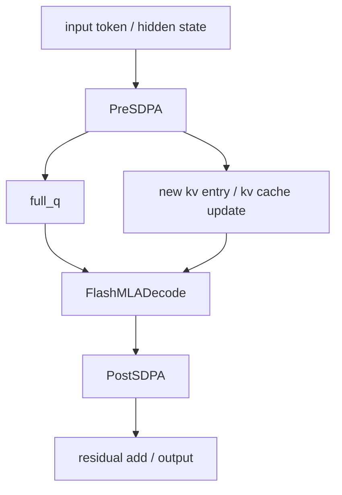
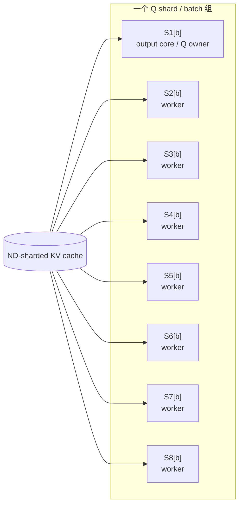
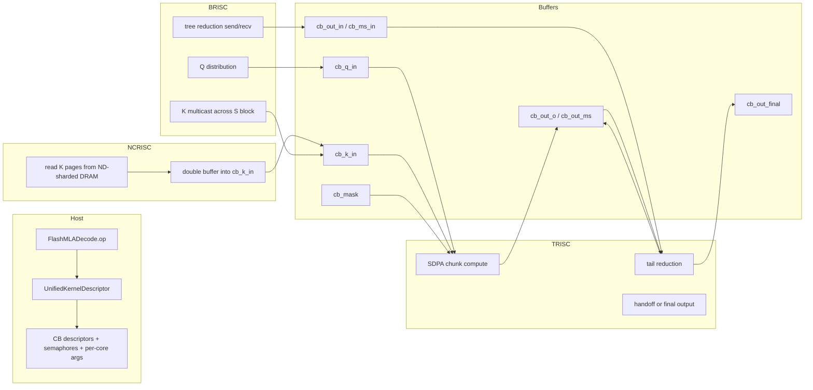
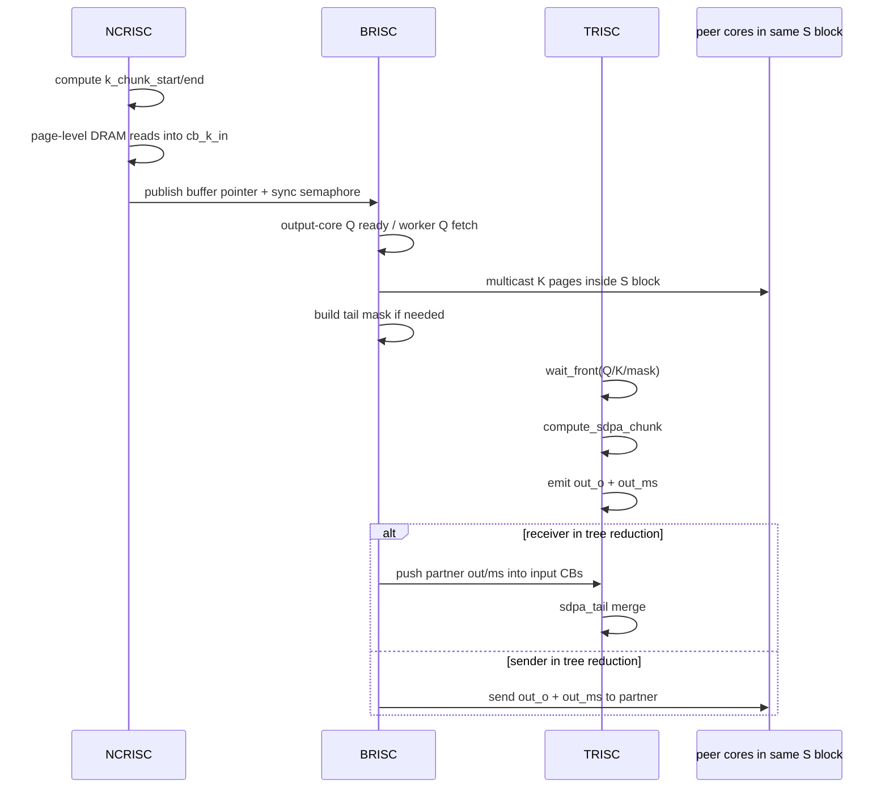

# 实验性 FlashMLA 数据流分析与优化建议

## 1. 文档目的

这份文档分析的是 `models/demos/deepseek_v3_b1/` 下那条**实验性 fused FlashMLA** 路径，而不是 `ttnn` 主线里已经产品化的 `sdpa/sdpa_decode` MLA-aware 路径。

目标是回答下面几个问题：

1. 这条实验路径和主线 `flash_mla` 的关系是什么
2. `FlashMLADecode` 这个 micro-op 到底如何启动、如何切分 core、如何搬运数据
3. `NCRISC / BRISC / TRISC` 在这套统一 kernel 里分别承担什么职责
4. 它在 `PreSDPA / AttentionBlock / PostSDPA` 这条更大粒度 fused 路径里处在什么位置
5. 现有实现有哪些明显的边界和可优化点

本文重点覆盖这些文件：

- `models/demos/deepseek_v3_b1/micro_ops/flash_mla/op.py`
- `models/demos/deepseek_v3_b1/unified_kernels/flash_mla.hpp`
- `models/demos/deepseek_v3_b1/micro_ops/flash_mla/kernels/flash_mla_kernel.cpp`
- `models/demos/deepseek_v3_b1/fused_ops/pre_sdpa/op.py`
- `models/demos/deepseek_v3_b1/fused_ops/attention_block/op.py`
- `models/demos/deepseek_v3_b1/micro_ops/host_io/op.py`
- `models/demos/deepseek_v3_b1/micro_ops/flash_mla/kernels/rt_args_common.hpp`

## 2. 一句话总结

这条实验性 FlashMLA 路径本质上是一个**面向 DeepSeek V3 B1 decode 的专用 fused decode micro-op**：

- host 侧不是走 `sdpa_decode_program_factory.cpp`，而是由 Python `op.py` 直接构建 `UnifiedKernelDescriptor`
- device 侧不是标准 `reader / compute / writer` 三文件，而是一个统一的 `flash_mla.hpp`，分别在 `NCRISC / BRISC / TRISC` 三侧展开
- `K` 通过 `ND-sharded DRAM + page-level pipeline + multicast` 送到各个 S block
- `V` 不再单独有一个 `cb_v_in`，而是直接复用 `K` buffer
- reduction 不是标准 `sdpa_decode` 的 writer tree，而是这套 micro-op 自己内嵌的 tree reduction
- 它既可以独立作为 `FlashMLADecode.op` 运行，也可以嵌到更大的 `AttentionBlock` fused 路径中

但它目前仍然是明显的实验实现：

- 默认布局只对 `NOC0` 优化
- `WH` 虽然定义了 grid，但运行时仍直接走 reference fallback
- decode 假设非常强，泛化能力明显弱于主线 `sdpa_decode`

## 3. 它和主线 FlashMLA 的关系

先把两条路径区分清楚：

| 维度 | 主线 MLA-aware SDPA | 实验性 FlashMLA |
|---|---|---|
| 主入口 | `ttnn.transformer.flash_mla_*` / `paged_flash_multi_latent_attention_decode` | `models/demos/deepseek_v3_b1/micro_ops/flash_mla/op.py` |
| host 组装 | `sdpa_program_factory.cpp` / `sdpa_decode_program_factory.cpp` | Python 直接组装 `UnifiedKernelDescriptor` |
| device 组织 | reader / compute / writer 分离 | `flash_mla.hpp` 单一 micro-op，三侧展开 |
| 适用范围 | 通用 MLA-aware attention | DeepSeek V3 B1 专用 decode 原型 |
| `V` 处理 | 主线支持 `reuse_k` 或显式 `V` | 无独立 `V CB`，compute 直接从 `K` buffer 取 `V` |
| 拓扑 | 相对通用，可由 program factory 决定 | S block 布局和 DRAM bank 映射高度硬编码 |
| 架构状态 | WH/BH 都有正式路径 | BH 为主；WH 目前 fallback 到 PyTorch reference |
| 融合粒度 | attention 本体为主 | 可嵌入 `PreSDPA -> FlashMLA -> PostSDPA -> AttentionBlock` |

可以把它理解成：

- 主线路径偏“通用 MLA attention”
- 实验路径偏“decode-only fused kernel 原型”

## 4. 顶层执行路径

### 4.1 在更大 fused block 里的位置

实验性 FlashMLA 真正有意义的上下文，不是单独一个 `FlashMLADecode.op`，而是它被放进了更大粒度的 fused decode 路径里。

这一层在代码里对应：

- `fused_ops/pre_sdpa/op.py`
- `micro_ops/flash_mla/op.py`
- `fused_ops/post_sdpa/op.py`
- `fused_ops/attention_block/op.py`

其中：

- `PreSDPA` 负责前面的 RMSNorm / matmul / RoPE / KV cache update 准备
- `FlashMLADecode` 负责 attention 核心
- `PostSDPA` 负责后处理和投影
- `AttentionBlock` 把这些更大粒度地串起来

### 4.2 独立 micro-op 视角

如果只看 `FlashMLADecode.op(...)` 自己，它的输入输出更简单：

- 输入：`q_tensor`、`kv_cache_tensor`、`cur_pos_tensor`
- 参数：`head_dim_v`、`scale`、`program_config`、`compute_kernel_config`
- 输出：`output_tensor`

这条独立路径主要用于：

- 内核 bring-up
- 单算子正确性验证
- 和主线 `sdpa_decode` 的行为做对照

## 5. Host 侧：实验性 FlashMLA 如何启动

### 5.1 `FlashMLAProgramConfig`

`micro_ops/flash_mla/op.py` 中的 `FlashMLAProgramConfig` 很小，但决定了整条路径最重要的两个量：

- `k_chunk_size`
- `grid`

其中最关键的约束是：

- `device_chunk_size = grid.CORES_PER_BLOCK * k_chunk_size`

这意味着实验内核不是随便切 chunk，而是把：

- 一个 device 的有效 seq chunk 大小
- 和 S block 内的 cores 数量

绑定到了固定关系上。

### 5.2 空间布局：S block

实验路径最核心的 host 设计，不是 CB，而是**S block 布局**。

`op.py` 里定义了两套 grid：

- `FlashMLAOptimalGridNOC0`：Blackhole，用 8 个 S block，每个 block 8 个 core
- `FlashMLAOptimalGridNOC0_WH`：Wormhole，用 6 个 S block，每个 block 4 个 core

它们都显式编码了：

- 每个 S block 的 core 坐标
- 每个 S block 对应最优 DRAM bank
- 跨 S block 的 tree reduction 顺序

这和主线的核心差异是：

- 主线更像“从输入 shape 推导分配”
- 实验路径更像“先固定一套最优拓扑，再把 workload 映射进去”

### 5.3 BH 上的 S block 语义

Blackhole 默认布局可以简化理解成：

但这张图只表达了“一个 Q shard 的 batch 组使用了每个 S block 的一个 core”。

更关键的实际规则有两个：

1. `S1` 的 cores 同时承担 `Q output core` 的角色
2. 每个 S block 的**第一个 core**会作为该 block 的 `K multicast sender`

这意味着实验路径同时叠了两种结构：

- 按 Q shard 切 batch group
- 按 S block 做 seq-len parallel 和 multicast/reduction

### 5.4 KV cache 的布局要求

实验性 `FlashMLADecode` 对 KV cache 的要求非常强：

- 必须是 `ND sharded`
- 必须在 `DRAM`
- shard 高度必须正好等于 `k_chunk_size`
- shard 分布要走 `ROUND_ROBIN_1D`
- bank 顺序要和 `grid.OPTIMAL_DRAM_BANK_ORDER` 对齐

这一点从测试和 `op.py` 里都能看出来。

它背后的设计意图很明确：

- chunk 分布和 DRAM bank 绑定
- core 的 strided chunk assignment 和 bank 轮转保持一致
- 让同一 core 尽量总是碰到同一 bank 或同一类访存路径

### 5.5 `UnifiedKernelDescriptor`

实验路径最值得注意的一点，是它不是手工分别创建三个 kernel，而是构造一个 `UnifiedKernelDescriptor`：

- kernel source：`micro_ops/flash_mla/kernels/flash_mla_kernel.cpp`
- `ncrisc` / `brisc` / `trisc` 各自有独立的 named compile-time args
- 三类 RISC 各自有 per-core runtime args
- 最后统一打成 `ProgramDescriptor`，交给 `ttnn.generic_op(...)`

也就是说，这条路径的 host 侧抽象层次更高：

- 不再是传统“program factory -> create kernel”
- 而是“Python 组装一个统一内核描述符”

## 6. 实验 kernel 的核心数据流

### 6.1 顶层图

这张图里有三个和主线不同的关键点：

1. **没有单独的 `cb_v_in`**
2. **BRISC 不只是 writer，它同时承担 Q 分发、K multicast、tree reduction 协议**
3. **TRISC 不只做局部 attention，还负责 tail reduction 和最终 handoff**

### 6.2 NCRISC：K page reader

#### 6.2.1 主要职责

在这套实验内核里，`NCRISC` 的职责比主线 decode reader 更单纯：

- 基本只负责 `K` 的 DRAM 读取
- 按页做 pipelined read
- 把读到的数据放进 `cb_k_in`
- 配合 BRISC 做双缓冲同步

它不负责：

- 单独搬 Q
- 单独搬 V
- 做 tree reduction

#### 6.2.2 chunk 分配

`rt_args_common.hpp` 里的 `get_runtime_args(...)` 非常重要，它使用的是**按 stride 的 chunk 分配**：

- core `N` 处理 chunk `N, N + num_cores, N + 2*num_cores, ...`

它的设计目的不是平均分配这么简单，而是：

- 让 chunk 分配和 ND-sharded DRAM 的 round-robin bank 排布对齐
- 尽量让每个 core 总是触碰同一模式的 DRAM bank

这说明实验路径是明显的“访存拓扑先行”。

#### 6.2.3 page-level pipeline

NCRISC sender 使用：

- `k_page_size`
- `k_num_pages`
- 多个 `TRID`

把一个 K chunk 分成多个 page 逐页读。

这背后的目标有两个：

- 让 DRAM read 可以尽快起飞，不等整 chunk
- 和 BRISC 侧的 multicast 形成页级 overlap

#### 6.2.4 NCRISC/BRISC 双缓冲同步

这套实验实现里最有特点的一点，是 NCRISC 和 BRISC 之间共享了几段同步状态：

- 当前/下一块同步 semaphore
- 当前/下一块 `k_write_ptr`

这意味着：

- NCRISC 不只是把数据写入 `cb_k_in`
- 它还把“写在哪一块 buffer、这一块是否 ready”显式通知 BRISC

主线路径里也有 overlap，但这条实验路径把 overlap 做得更显式、更偏 page-level。

### 6.3 BRISC：这里的“writer”其实是网络控制器

#### 6.3.1 主线和实验路径最大的差异

在主线 `sdpa_decode` 里，writer 主要承担：

- tree reduction
- root write-back

但在实验性 FlashMLA 里，`BRISC` 做的事情明显更多：

1. 管理 Q 的可见性和分发
2. 发起 K multicast
3. 生成尾 chunk mask
4. 处理 tree reduction sender/receiver 协议

所以这里的 `BRISC` 更像：

- 数据流协调器
- block 内网络控制器
- reduction 协议执行器

#### 6.3.2 Q 分发

Q tensor 本身是 height-sharded 到 `S1` output cores 上的。

BRISC 的 Q 逻辑大致是：

- output core 在本地 `cb_q_in` 上 `wait_front`
- 其它 worker core 在得到信号后，从 output core 的 L1 读取 Q
- `q_input_mcast_semaphore` 用来协调“Q 已经 ready，可供全组读取”

这也是实验路径很特别的一点：

- Q 并不是由 NCRISC 去统一读进所有 worker
- 而是由 BRISC 把 output core 上现成的 Q 扩散给整组 worker

#### 6.3.3 K multicast

K multicast 是这条路径最核心的 reader-side 优化。

规则是：

- 每个 S block 的第一个 core 是 sender
- sender 先由 NCRISC 把 K chunk 读到本地 `cb_k_in`
- BRISC 再把这块 K 用 `noc_async_write_multicast` 发给同 block 的其它 core

这一步的意义是：

- 同一个 S block 内不需要每个 core 都回 DRAM 读同一份 K
- 用 S block 内的 multicast 把 DRAM 流量换成片上 NoC 流量

这和主线 decode 的 `K multicast` 精神一致，但实验路径做得更激进，也更硬编码。

#### 6.3.4 尾块 mask

当最后一个 chunk 不满时，BRISC 会直接在 device 侧构造一个尾块 mask tile：

- 前半部分写 `0`
- padding 部分写 `-inf`

这说明实验路径没有把 mask 当作一个独立的大 tensor 来处理，而是把它当成：

- 一个局部控制 tile
- 一个仅用于尾块的特殊辅助输入

#### 6.3.5 Tree reduction

实验路径的 reduction 不是“等所有人都结束再 root gather”，而是显式编码成：

- sender：把 `out_o` 和 `out_ms` 写到 partner 的中间 buffer，再 `semaphore_inc`
- receiver：等 round 对应的 semaphore 位置 ready，再把数据 `push_back` 给 TRISC

而 reduction 的 sender/receiver 角色，是 host 侧根据 `TREE_REDUCTION_ORDER` 事先算好的。

### 6.4 TRISC：attention 本体和 tail reduction

#### 6.4.1 compute 输入

TRISC 的 compile-time args 里没有 `cb_v_in`，这一点非常关键。

它只显式依赖：

- `cb_q_in`
- `cb_k_in`
- `cb_mask`
- reduction 相关的 `cb_out_in / cb_ms_in / cb_interm_out / cb_interm_ms`
- 输出相关的 `cb_out_o / cb_out_ms / cb_out_final`

这意味着：

- `V` 没有独立的 L1 staging buffer
- 计算路径直接把 `K/V shared tensor` 语义内嵌到 compute 逻辑里

#### 6.4.2 attention 本体

TRISC 会对每个 chunk 调 `compute_sdpa_chunk(...)`，完成：

- `QK^T`
- online softmax
- `P @ V`

这里的一个重要特点是：

- `Q` 用 tiny tile
- `K` 用 full tile
- `out` 和 `m/s` 统计继续用 tiny tile

这说明实验路径是围绕 `Q heads per core = 8` 这类 DeepSeek B1 特定布局调过的。

#### 6.4.3 tail reduction

如果当前 core 是 reduction receiver，TRISC 还会继续做 `sdpa_tail(...)`：

- 把来自其它 S block 的 `m/s` 和 `o` 合并
- 逐步把 8 个 S block 收敛成更少的结果

最终结果根据模式有三种去向：

1. 直接写到 `cb_out_final`
2. 写到 `cb_out_o / cb_out_ms`，交给后续 fused 路径
3. 写到中间 CB，继续等待下一轮 reduction

这也是实验路径和主线不同的地方：

- TRISC 自己就承担了更多“最终结果组织”的责任

### 6.5 单个 chunk 的时序图

这张图里最值得注意的是：

- `K` 的主搬运发生在 `NCRISC + BRISC` 联合路径上
- `Q` 的主扩散发生在 `BRISC`
- `TRISC` 从来不等待一个独立的 `V CB`

## 7. CB 与 semaphore 速查表

### 7.1 CB 速查表

`op.py` 里定义的关键 CB 如下：

| CB | 含义 | 备注 |
|---|---|---|
| `cb_q_in = 0` | Q 输入 | 来自 S1 output core 的 tiny-tile Q |
| `cb_k_in = 1` | K/KV 输入 | 双缓冲；K page reader 与 multicast 共用 |
| `cb_mask = 2` | mask 输入 | 主要用于尾块 mask |
| `cb_ms_in = 3` | reduction 输入统计 | 来自 partner 的 `m/s` |
| `cb_out_in = 4` | reduction 输入输出 | 来自 partner 的 `o` |
| `cb_out_o = 5` | 本地 compute 输出 `o` | tiny tile |
| `cb_out_ms = 6` | 本地 compute 输出 `m/s` | tiny tile |
| `cb_interm_out = 7` | reduction 中间输出 `o` | 按 step 分槽 |
| `cb_interm_ms = 8` | reduction 中间输出 `m/s` | 按 step 分槽 |
| `cb_out_final = 9` | 最终输出 | 独立 op 时使用；在 full fused block 中可复用别的 CB |

和主线最大的不同是：

- 没有 `cb_v_in`
- `cb_out_o / cb_out_ms / cb_interm_*` 这套 tiny-tile 中间格式非常显式

### 7.2 Semaphore 速查表

| semaphore | 作用 |
|---|---|
| `reducer_semaphore_id` | tree reduction 的 child-ready / partner-ready |
| `mcast_semaphore_id` | K multicast 数据 ready |
| `ncrisc_brisc_sync_semaphore_id` | NCRISC/BRISC page-level overlap 与双缓冲同步 |
| `receiver_ready_semaphore_id` | receiver 表示“我这边 buffer 已 reserve，可接收下一块” |
| `q_input_mcast_semaphore_id` | Q 输入可见性和 worker 读取协调 |
| `kv_cache_cur_pos_ready_semaphore_id` | 上游 KV cache update 已完成，当前 cur_pos 可用 |

这张表说明实验路径是非常典型的：

- 用大量细粒度 semaphore 显式控制流水线
- 用同步复杂度换更强的片上拓扑控制

## 8. 它在 `AttentionBlock` 里的集成方式

`AttentionBlock` 不是简单调用一次 `FlashMLADecode.op(...)`，而是把很多 setup 直接内嵌进自己的 `get_program_context(...)`。

### 8.1 复用 FlashMLA 的布局和常量

`attention_block/op.py` 明确复用了：

- `FlashMLADecode.ProgramConfig()`
- 其 grid 定义
- 其 `k_chunk_size`
- 其 `k_page_size / k_num_pages` 计算逻辑

这意味着：

- 大块 fused block 并没有重新发明一套 MLA 空间布局
- 它是直接复用这套实验 micro-op 的拓扑假设

### 8.2 复用但不完全照搬输出模式

在 full fused attention block 里，有一个很有意思的地方：

- `mla_out_final_cb = mla_out_o_cb`

这说明：

- 在更大 fused block 里，FlashMLA 结果不一定要作为“最终 attention 输出”单独落地
- 它可以直接作为下一段 `PostSDPA` 的输入

因此从工程语义上看：

- 独立 `FlashMLADecode.op` 是一个可单测的 decode micro-op
- `AttentionBlock` 则是把它嵌进更大流水里的“中间 stage”

### 8.3 和 `PreSDPA / PostSDPA` 的关系

更完整地说：

- `PreSDPA` 负责把输入 hidden state 变成 `full_q` 和更新后的 `KV`
- `FlashMLA` 负责用 `full_q + KV cache` 做 attention
- `PostSDPA` 负责把输出继续送到后续投影和 residual 路径

所以实验路径真正要表达的不是“又写了一个 attention”，而是：

- 正在尝试把 `DeepSeek V3 B1 decode` 的关键段落按更强的融合粒度组织起来

## 9. 外围运行环境与 SP/Host 线索

虽然本文重点不是 `host_io`，但有两条外围线索值得记住。

### 9.1 `rt_args_common.hpp` 的 SP 语义

`rt_args_common.hpp` 里提供了：

- `get_device_mla_work_assignment(...)`
- `get_runtime_args(...)`

前者说明实验路径已经在考虑：

- 多 SP device 场景下，token 按 `device_chunk_size` round-robin 分配
- 不同 device 是否拥有当前写槽
- `local_cur_pos` 如何换算

这意味着这条路径并不是只考虑单设备，而是已经埋入了 SP decode 的工作分配语义。

### 9.2 `HostInterface`

`micro_ops/host_io/op.py` 说明了 Blitz Decode 侧正在搭 host/device socket 通道，但当前有明显限制：

- 只支持单 core / 单 chip host communication
- H2D 和 D2H 需要在同一 core
- 终止逻辑靠全局 semaphore

这和 FlashMLA 的关系是：

- 它不是 attention 本体的一部分
- 但它反映了实验 fused decode 正在朝“更完整 runtime pipeline”靠近，而不仅是单算子 benchmark

## 10. 当前边界与假设

这条实验路径目前有很多强约束，文档里必须明确写出来。

### 10.1 架构边界

- Blackhole 是主目标架构
- `FlashMLAOptimalGridNOC0` 明确声明只对 `NOC0` 最优
- `NOC1` 的镜像坐标还没有对应优化
- Wormhole 虽然定义了 `FlashMLAOptimalGridNOC0_WH`，但 `op.py` 当前直接返回 `_wh_reference_fallback(...)`

也就是说：

- WH 的 grid 设计存在
- 真正的 WH kernel 还没有稳定到可正式使用

### 10.2 数学/shape 假设

`op.py` 里有几条硬性假设：

- `PNHt == 1`
- `num_kv_heads == 1`
- `num_heads_per_core == 1`
- `Bkv == 1`
- `Q` 必须是 `TILE_LAYOUT`
- `Q` 必须 height-sharded 到 S1 output cores
- `KV cache` 必须 ND-sharded 到 DRAM，且 shard height = `k_chunk_size`

这说明它更像：

- 一个为 DeepSeek V3 B1 当前 decode shape 精调的原型

而不是：

- 一个随意改 shape 也能工作的通用库内核

### 10.3 融合边界

虽然它已经明显比主线更 fused，但仍然不是“所有东西都塞进一个 kernel”：

- `PreSDPA` 依旧是独立阶段
- `PostSDPA` 依旧是独立阶段
- `AttentionBlock` 是更大粒度 orchestrator

所以它的真实状态更准确地说是：

- **fused decode 段落原型**

而不是：

- **单 kernel 端到端整个 attention block**

## 11. 这条实验路径最有价值的地方

虽然边界很多，但它也体现出了几条主线暂时没有那么激进的工程思路。

### 11.1 `V` 不再单独 staging

主线里哪怕 `reuse_k`，通常还是会显式保留 `cb_v_in` 的概念。

实验路径则更进一步：

- 没有独立 `V CB`
- compute 直接把 `K/V share tensor` 的语义内嵌进去

这减少了：

- L1 buffer 种类
- host 侧 CB 配置复杂度
- 某些 staging copy

### 11.2 page-level overlap 更显式

`NCRISC <-> BRISC` 之间通过：

- `k_page_size`
- `k_num_pages`
- `TRID`
- 双缓冲同步 semaphore

把 DRAM 读取和 block 内 multicast 对齐得更紧。

这比“整 chunk 读完再发”更激进。

### 11.3 reduction 完全嵌入 S block 拓扑

tree reduction 顺序在 grid 定义里就是显式的：

- sender / receiver 角色由 host 提前算好
- runtime args 直接把 partner 坐标传到每个 core

这让 reduction 不再是“运行时临时找 partner”，而是固定拓扑上的协议。

## 12. 最值得优先做的优化点

### 12.1 高优先级：完成真正的 WH kernel bring-up，移除 runtime fallback

#### 现状

WH 路径虽然有：

- 独立 grid 定义
- 独立单测

但 `FlashMLADecode.op(...)` 在 WH 上仍然会直接走 `_wh_reference_fallback(...)`。

#### 含义

这意味着：

- WH 侧的大部分 kernel 细节还没有被真实 runtime 持续验证
- WH 单测本质上更多是在验证接口和 reference 行为，而不是 device kernel 本身

#### 建议

优先把以下路径真正拉起来：

1. `NCRISC` K page reader
2. `BRISC` Q 分发 + K multicast
3. `TRISC` attention + tail reduction

先在 `decode_1k / 4k` 稳住，再放大到更长序列。

### 12.2 高优先级：把 `grid + bank mapping + chunk planner` 抽成共享 planner

#### 现状

现在 `FlashMLADecode.op.py` 和 `attention_block/op.py` 里有明显重复的 setup：

- `ProgramConfig`
- grid
- `k_page_size / k_num_pages`
- `num_cores_per_head`
- `mla_*` compile-time args

#### 问题

这类重复最容易导致：

- 一个地方改了布局，另一个地方忘了改
- standalone micro-op 和 full fused block 的行为逐渐漂移

#### 建议

抽成一个共享 planner / config builder，统一产出：

- core mapping
- per-RISC named compile-time args
- CB/semaphore 规划

这样后面无论做：

- WH bring-up
- NOC1 优化
- `num_kv_heads > 1`

都会更容易维护。

### 12.3 高优先级：减轻 BRISC 过载

#### 现状

BRISC 目前同时承担：

- Q 分发
- K multicast
- tail mask
- tree reduction sender/receiver

#### 问题

这很容易把 BRISC 变成控制热点，尤其是在：

- 长序列
- 大 S block
- reduction step 较多

时。

#### 建议

优先考虑：

1. 给 Q 分发增加更轻的可见性协议，减少 BRISC 额外等待
2. 评估是否能把部分 K multicast 协调挪回 NCRISC
3. 给 tree reduction receiver wait / sender wait 加 profiling marker，看 BRISC 真正主热点在哪

### 12.4 高优先级：把 `push_dummy_sdpa_inputs()` 对应的 TODO 真正完成

`flash_mla.hpp` 里已经有一个很明确的 TODO：

- 把 final SP reduce 融进 FlashMLA
- 消掉 caller 侧手工 dummy push

这是一个非常值得做的结构优化，因为它能减少：

- 上层 orchestrator 的额外特殊分支
- “这个 device 没有序列数据时” 的 dummy handoff 逻辑

也能让 FlashMLA 更接近真正的封闭式 fused stage。

### 12.5 中优先级：把 `NOC0-only` 布局推广到 `NOC1-aware` / 更一般拓扑

#### 现状

`FlashMLAOptimalGridNOC0` 的注释已经写得很明确：

- 这套布局只对 `NOC0` 最优
- `NOC1` 的最优坐标不同

#### 建议

后续至少应支持：

- `NOC1` 对应的镜像布局
- 或者根据 device API 自动生成近似最优布局

否则这条路径对不同平台和不同 NoC 路由的鲁棒性会比较差。

### 12.6 中优先级：让实验路径也具备主线那种细粒度 profile marker

主线现在已经能较好地看到：

- `reader reserve`
- `writer cb_wait`
- `tree child wait`
- `output gather wait`

而实验路径虽然有一些 `DeviceZoneScopedN(...)`，但还不够系统。

建议补几类 marker：

- Q 分发等待
- K page read issue / wait
- BRISC multicast sender wait
- reduction sender / receiver wait
- TRISC tail reduction 时间

这样后面分析实验路径时，就不会只能靠总 kernel 时间猜。

## 13. 建议的验证方法

### 13.1 独立 micro-op

优先验证：

- `test_flash_mla.py`
- `test_flash_mla_wh.py`

重点看：

- 不同 `decode_position` 下数值一致性
- stress test 下多次迭代结果稳定性
- WH 是否仍然落到 fallback

### 13.2 全 fused block

对 `AttentionBlock` 路径，重点看：

- `PreSDPA -> FlashMLA -> PostSDPA` 交界处的 CB 格式和 tile 尺寸是否完全一致
- full fused block 下 `mla_out_o_cb / mla_out_ms_cb` 是否成为热点 handoff buffer
- KV cache update 完成信号是否按预期唤醒 FlashMLA

### 13.3 性能方向

如果后面要做 profiling，最值得先盯的代表点是：

- `decode_1k`
- `decode_4k`
- `decode_32k`

重点回答：

- BRISC 是否已经成为控制热点
- sender core 的 `K multicast` 是否是新的 critical path
- `k_page_size / k_num_pages` 是否足够匹配真实 NoC/DRAM 行为

## 14. 结论

这条实验性 FlashMLA 路径代表的，不是“又写了一个 decode kernel”，而是一次更激进的方向尝试：

- 把 `DeepSeek V3 B1 decode` 的 attention 核心按固定 S block 拓扑重写
- 让 `K` 搬运、multicast、reduction、post handoff 都更像一个专用数据流系统

它最有价值的地方在于：

- `V` 不再单独 staging
- `K` 的 page-level overlap 和 multicast 更显式
- tree reduction 直接写进拓扑定义
- 可以被更大粒度的 `AttentionBlock` 复用

它当前最大的限制在于：

- 对 shape、grid、bank mapping 的假设非常强
- BRISC 承担的职责过重
- WH 仍停留在 fallback 阶段
- 这套路径和更大 fused block 之间仍有不少重复 setup

因此，后续最值得优先做的不是盲目再堆新功能，而是：

1. 先把 BH/WH 真实 kernel 路径稳定下来
2. 再把 planner 和 runtime arg 组织抽象成共享组件
3. 然后围绕 BRISC 负担、K multicast sender hotspot、final SP reduce 融合继续收敛
