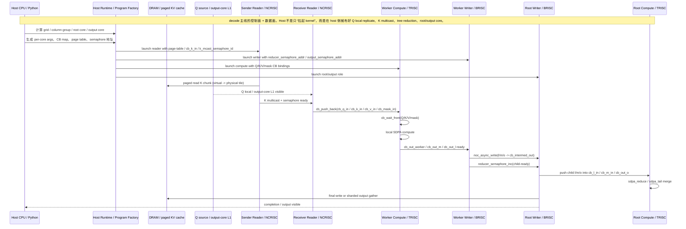
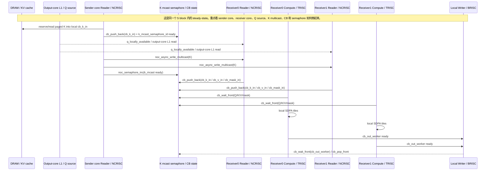
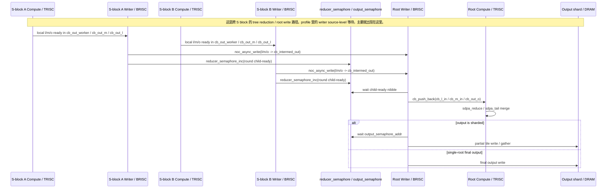
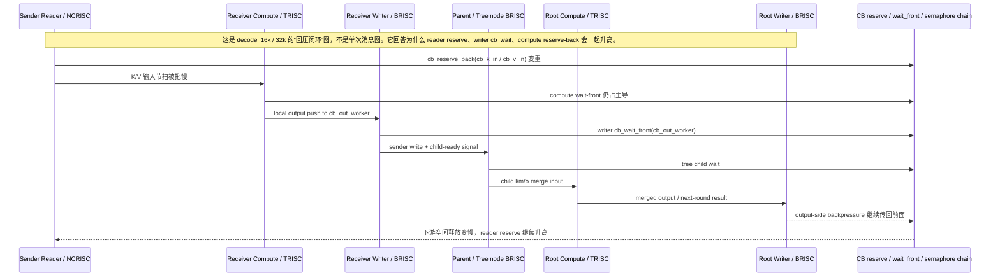
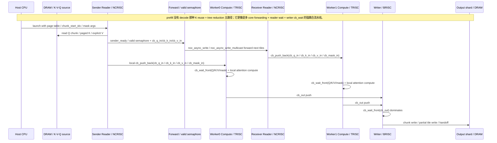

# FlashMLA WH 详细泳道图

## 1. 这份图是按哪条路径画的

这份文档画的是**当前真正有 WH profile 数据支撑的主线 FlashMLA 路径**，不是实验性 unified kernel 路径。

图里的角色和信号，优先和下面这些内容对齐：

- `mla_flash_attention_dev/docs/flash-mla-current-dataflow-analysis.md`
- `mla_flash_attention_dev/docs/flash-mla-wh-component-utilization-and-bubble-analysis.md`
- 现有 decode / prefill profile 结果

因此这里的泳道会尽量把这些对象画出来：

- `Host CPU`
- `DRAM / paged KV cache / output shard`
- `Reader / NCRISC`
- `Compute / TRISC`
- `Writer / BRISC`
- `同一个 S block 内的 sender / receiver / worker`
- `不同 S block 之间的 reduction / root / output gather`
- `CB / semaphore / barrier` 这些控制信号

## 2. 读图约定

- 横向时间轴仍然是**概念上的 steady-state 时序**，不是严格 wall-time 比例。
- 一个 participant 代表一个**功能泳道**，不一定是单独的 C++ 文件。
- 图里写出来的 `cb_*`、`semaphore`、`wait_front`、`reserve_back` 都是在和现有 profile marker / stage breakdown 对齐。
- decode / prefill 的百分比来自现有 profile 结果，用于标注“哪里最热、哪里最堵”。

## 3. Decode：Host -> DRAM -> S block -> Root 的完整控制/数据面

### 图后解释

- 这张图最重要的是把 `Host CPU` 放进来了，因为 decode 的热点并不是 device 自己临时决定的，而是 host 在 launch 前就通过布局把：
  - `K multicast`
  - `tree reduction`
  - `root/output core`
  - `Q local replicate`
  这些角色固定下来了。
- 从 profile 的角度看，这条链路上的热点主要是：
  - 长序列时 reader 的 `reserve`
  - writer 的 `cb_wait`
  - compute 的 `wait-front / reserve-back`

## 4. Decode：同一个 S block 内部的细粒度泳道

### 图后解释

这张图更接近 `decode_4k` 的关键迁移点。

和 profile 对齐后，可以把热点读成：

- reader：
  - `decode_4k` 时 `issue = 47.94%`
  - `reserve = 39.78%`
  - `k_reserve = 31.64%`
- compute：
  - `wait-front` 仍是 bubble 主体，约 `78.12%`
  - 但 `reserve-back` 已升到约 `21.88%`
- writer：
  - `cb_wait = 98.10%`

也就是说，同一个 S block 内部最关键的传导关系是：

- sender core 负责把 K 从 DRAM 读起并 multicast 出去
- receiver core 的 compute 还在大量 `wait_front`
- 但 sender / receiver 的节拍已经开始被 `K reserve` 和下游 `cb_wait` 共同卡住

## 5. Decode：不同 S block 之间的 reduction / root / output gather

### 图后解释

这张图最适合对齐 `decode_16k / 32k` 的 writer source-level 结果：

- `sender_cb_wait ≈ 49.9%`
- `tree_child_wait ≈ 50.1%`
- `root_cb_wait ≈ 0%`
- `output_gather_wait ≈ 0%`

因此跨 S block 路径的重点结论不是“root 写出太慢”，而是：

- sender 在等本地 partial result ready
- parent / root 在等 child-ready semaphore
- 真正主导等待的是 sender/tree 两段，而不是 final gather

这也解释了为什么长序列 decode 的 writer 会几乎全部表现为 `cb_wait`。

## 6. Decode：长序列下的多 core 回压回路

### 图后解释

这张图对应的是 profile 里的“闭环传导”：

- reader `reserve`：
  - `decode_8k = 51.96%`
  - `decode_16k = 59.71%`
  - `decode_32k = 61.54%`
- writer `cb_wait`：
  - `decode_8k = 98.90%`
  - `decode_16k = 99.56%`
  - `decode_32k = 99.77%`
- compute bubble：
  - `reserve-back share` 从 `25.20%` 升到 `28.04%` 再到 `29.09%`

所以长序列 decode 最准确的图像不是“一个点慢”，而是：

- `reader reserve`
- `writer cb_wait`
- `tree child wait`
- `compute reserve-back`

这几件事已经形成了稳定回压回路。

## 7. Prefill：多 core + DRAM + forwarding / writer 的详细泳道

### 图后解释

这张图对应 `prefill_4k` 的 profile：

- reader：
  - `wait = 66.10%`
  - `issue = 33.15%`
  - `reserve = 0.33%`
- writer：
  - `cb_wait = 99.62%`
  - `issue = 0.19%`
  - `barrier = 0.19%`
- compute：
  - `PM FPU util = 19.427%`
  - `wait-front share in bubble = 92.6%`

因此 prefill 的关键不是“某一个 sender 或 root 太热”，而是：

- reader 主要在等 read completion
- writer 主要在等 compute 把结果送到 `cb_out`
- compute 自己又主要在等前端输入

## 8. 信号/原语到泳道的映射

为了让这些图和 profile 结果能对上，下面这些原语可以直接按泳道来读：

| 原语/信号 | 主要出现在图里的哪里 | 代表的真实含义 |
|---|---|---|
| `cb_reserve_back` | reader / sender 侧 | 生产者在等下游释放空间，典型 backpressure |
| `cb_wait_front` | compute / writer / sender | 消费者在等上游产出数据 |
| `cb_push_back` | reader -> compute、writer -> root | 把数据暴露给下游 |
| `cb_pop_front` | writer / consumer | 消费后释放空间 |
| `k_mcast_semaphore_id` | 同 S block K multicast | sender 告诉 receiver：K 已 ready |
| `reducer_semaphore_addr` | 跨 S block reduction | child 告诉 parent：`l/m/o` 已 ready |
| `output_semaphore_addr` | root/output gather | sharded output 还要继续等其它 reducer |
| `noc_async_read_barrier` | reader / mask / paged read | 等一批 DRAM read 完成 |
| `noc_async_write_barrier` | sender / writer | 等 NoC 写事务刷完 |

## 9. 和简版泳道图的关系

如果你只想快速讲清“瓶颈迁移”，先看：

- `mla_flash_attention_dev/docs/flash-mla-wh-profile-swimlane-diagrams.md`

如果你要讲：

- 同一个 S block 内部
- 不同 S block 之间
- 多个 tensix core 之间
- host / dram / semaphore / CB 信号

那就看这份详细版。

## 附：单个 S block 的 4-core 横向时间泳道图

上面的 Mermaid 图更适合讲“谁和谁在交互”。  
如果你更关心：

- 单个 `S block` 里 `Core0/1/2/3` 各自一整行
- 横向就是时间
- 每个 core 在每一段时间里具体在做什么

那下面这张自定义 `SVG` 更合适。

它对应的是：

- Wormhole 单个 `S block = 4 cores`
- `decode_16k` 风格的 steady-state 长序列场景
- `Core0` 作为 sender / output-core
- `Core1/2/3` 作为 receiver workers

### 这张图怎么读

- `Core0`：
  - 前半段承担 `NCRISC paged K read`
  - 然后承担 `BRISC K multicast sender`
  - 中间也要做本地 `TRISC compute`
  - 后半段还要承担 sender 侧的 reduction / child send
  - 最后下一块又会落回 `reader reserve`
- `Core1/2/3`：
  - 先等 `Q` 可见性和 `K mcast semaphore`
  - 再把收到的 `K/V/mask` `push_back` 给本地 compute
  - 然后经历 `TRISC wait_front -> TRISC compute -> BRISC child send`
- `Parent/Root`：
  - 主要做 `wait child-ready -> reduce -> output write/gather`
- 红色虚线回箭头：
  - 表示从 parent/root 侧回传到 sender/reader 的 backpressure
  - 它对应长序列 decode 里 `reader reserve` 和 `compute reserve-back` 的同步抬升

### 这张图和 profile 的对应关系

这张图不是随便示意，而是按现有长序列 decode 的 profile 结果落的：

- `reader reserve = 59.71%`
- `writer cb_wait = 99.56%`
- `bubble wait-front = 71.96%`
- `bubble reserve-back = 28.04%`

所以它最适合拿来解释：

- 为什么 sender core 容易变成热点
- 为什么同一个 `S block` 里多个 core 会一起陷入 `wait_front / cb_wait / reserve`
- 为什么长序列 decode 看起来像“整个 block 被锁成一个强耦合回压回路”

## 附：Prefill 单个 S block 的 4-core 横向时间泳道图

如果你想用和上面**同一种横向时间轴风格**去看 `prefill`，下面这张图更合适。

它对应的是：

- `prefill_4k` steady-state
- 单个 `S block = 4 cores`
- `Core0` 更偏 sender / first worker
- `Core1/2/3` 更偏 receiver workers
- 强调的是 `explicit Q/K/V read + forwarding + writer cb_wait`

### 这张图怎么读

- `Core0`：
  - 前段直接做 `Q/K/V` 读取
  - 然后通过 forwarding / valid semaphore 把下一批 tile 暴露给其它 worker
  - 中间依然会先经历 `TRISC wait_front`，再进入 compute
- `Core1/2/3`：
  - 节奏非常一致，体现的是 `recv -> wait_front -> compute -> cb_out`
- `Writer / Output`：
  - 大段时间都处在 `cb_wait_front(cb_out)`，这是整条 prefill 路径的核心等待点

### 这张图和 profile 的对应关系

这张图对齐的是 `prefill_4k` 的关键数字：

- `reader wait = 66.10%`
- `writer cb_wait = 99.62%`
- `PM FPU util = 19.427%`
- `wait-front share in bubble = 92.6%`

它最适合说明：

- prefill 不是 decode 那种 `K reserve` 主导模式
- prefill 的主矛盾是 `reader wait + writer cb_wait + compute wait-front`
- 即使 compute 在工作，主 wall-time 仍然不是由纯算术主导

## 附：Decode 跨 S block reduction / root 横向时间泳道图

如果你想把“多个 child block 如何把结果逐步汇到 parent/root”也改成**真正横向时间轴**去看，下面这张图就是对应版本。

它对应的是：

- `decode_32k` 风格的长序列 steady-state
- 多个 `S block` 的 worker core 把 `l/m/o` 写给 parent
- parent / root 做 `tree child wait -> merge -> upward send / final output`

### 这张图怎么读

- `S-block A/B/C worker`：
  - 每个 child core 都先完成本地 compute
  - 然后进入 `BRISC child send`
  - 再通过 `reducer_semaphore` 通知 parent
- `Parent reducer`：
  - 大段时间在 `tree child wait`
  - child 到齐后才做 `TRISC merge`
  - 然后再把结果往上送
- `Root / output core`：
  - 先等 parent-ready
  - 再做最后一轮 merge
  - 最后才真正把 output 写到外部

### 这张图和 profile 的对应关系

这张图对应的是长序列 decode writer source-level 结果：

- `sender_cb_wait ≈ 49.95%`
- `tree_child_wait ≈ 50.05%`
- `root_cb_wait ≈ 0%`
- `output_gather_wait ≈ 0%`

所以它最适合说明：

- 跨 `S block` 的主等待并不在最后写出
- 真正的热点是 child send 和 parent tree wait 之间的耦合
- 这也是为什么 writer 会在 profile 里几乎全部表现成 `cb_wait`

## 附：Decode 全链路横向时间泳道总图

如果你希望用**一张总图**把 decode 从 `Host launch`、`DRAM/Q source`、单个 `S block` 内 4 个 core 的 `read/forward/compute`，一直串到跨 `S block` 的 `reduction/root/output`，下面这张图就是对应版本。

它不是某一次 trace 的逐事件逐周期原样抄录，而是把前面几张代表图里最稳定、最主导 wall-time 的阶段拼接成一个**steady-state 合成时间轴**，更适合做总览讲解和汇报。

它对应的是：

- 长序列 `decode_16k ~ 32k` 风格的 steady-state 主路径
- `Core0` 同时承担 sender / output-core 角色
- `Core1/2/3` 主要承担 receiver worker 角色
- parent / root 路径负责 `tree child wait -> merge -> final output`

### 这张图怎么读

- `Host CPU / Runtime`：
  - 前半段是 grid、program args、semaphore、root/sender 的启动准备
  - 最后只在 output 真正可见后才观察到 completion
- `DRAM / Q source`：
  - 一部分表示 output-core 本地 `Q` 已可见
  - 一部分表示 paged `K` 从 cache / page table 路径进入 sender
  - 最后一小段表示最终 output shard 写出
- `Core0`：
  - 先接住 `Q local`
  - 再做 paged `K` 读取
  - 然后承担 `K multicast sender`
  - 接着经历 `cb_wait_front -> local compute`
  - 之后又要承担 `child send`
  - 最后还会被下一轮 `reader reserve` 和下游回压影响
- `Core1/2/3`：
  - 主要体现 `recv K + cb_push_back -> cb_wait_front -> local compute -> child send`
  - 说明 worker 并不是纯算术核，而是反复在输入就绪、局部计算和向 parent 送结果之间切换
- `Parent reducer` 与 `Root / output core`：
  - parent 主要先卡在 `tree child wait`
  - child 到齐后才 merge，再把结果往上送
  - root 端再做最后的 wait/merge/output

### 这张图和 profile 的对应关系

这张总图主要把几类已经稳定出现的 profile 信号串在一起：

- `reader reserve ≈ 59.71%`
- `writer cb_wait ≈ 99.56%`
- `sender_cb_wait / tree_child_wait ≈ 50 / 50`
- `compute reserve-back bubble ≈ 28.04%`

所以它最适合说明：

- decode 的主 wall-time 不是单一一个 `compute` 区间，而是 `paged K read -> block 内分发 -> compute 等待输入 -> child send/tree wait -> final output` 这条整链路共同决定的
- `Core0` 同时是 sender 和 output-core，使得控制路径、数据路径、同步路径叠在同一条 lane 上
- 长序列 decode 里真正大的空泡更多来自上游 reserve 和下游回压耦合，而不是最后 output write 本身

## 附：Decode vs Prefill 总对比横向时间泳道图

如果你想在**同一张图**上直接比较 `decode` 和 `prefill` 到底差在哪，下面这张图最适合拿去汇报。

它把：

- 上半部分放成长序列 `decode` steady-state
- 下半部分放成 `prefill_4k` steady-state
- 两者共用同一条横向时间轴

这样可以直接看出：

- `decode` 的关键链路更长，而且会继续跨到 `child send -> tree wait -> merge -> output`
- `prefill` 的主路径更多停留在块内 `read/forward/compute/write` 流水线
- `decode` 更像是“分页读取 + 分发 + reduction”耦合问题
- `prefill` 更像是“reader wait + writer cb_wait”主导的问题

### 这张图怎么读

- `Decode | DRAM / source -> Core0 -> Workers -> Reducer/root`：
  - 读图时重点看 `paged K`、`K multicast`、`child send`、`tree child wait`
  - 这些阶段说明 decode 的临界链路不仅跨 core，而且跨 `S block`
- `Prefill | DRAM / QKV -> Core0 -> Workers -> Writer/output`：
  - 读图时重点看 `Q/K/V` 显式输入、块内 forwarding、`cb_wait_front`、writer `cb_wait`
  - 这条链路说明 prefill 的主瓶颈更集中在块内流水线耦合

### 这张图和 profile 的对应关系

它主要把两边最稳定、最有代表性的信号直接并排放在一起：

- `decode`：
  - `reader reserve ≈ 59.71%`
  - `sender_cb_wait / tree_child_wait ≈ 50 / 50`
  - `reserve-back bubble` 已经明显可见
- `prefill`：
  - `reader wait ≈ 66.10%`
  - `writer cb_wait ≈ 99.62%`
  - `wait-front share in bubble ≈ 92.6%`
  - `PM FPU util ≈ 19.427%`

所以它最适合用于说明：

- `decode` 和 `prefill` 都不是“纯算术不够”，但两者等待的位置完全不同
- `decode` 的主要等待更偏向 `reserve/backpressure + cross-block reduction`
- `prefill` 的主要等待更偏向 `front-end data ready + writer consume`
