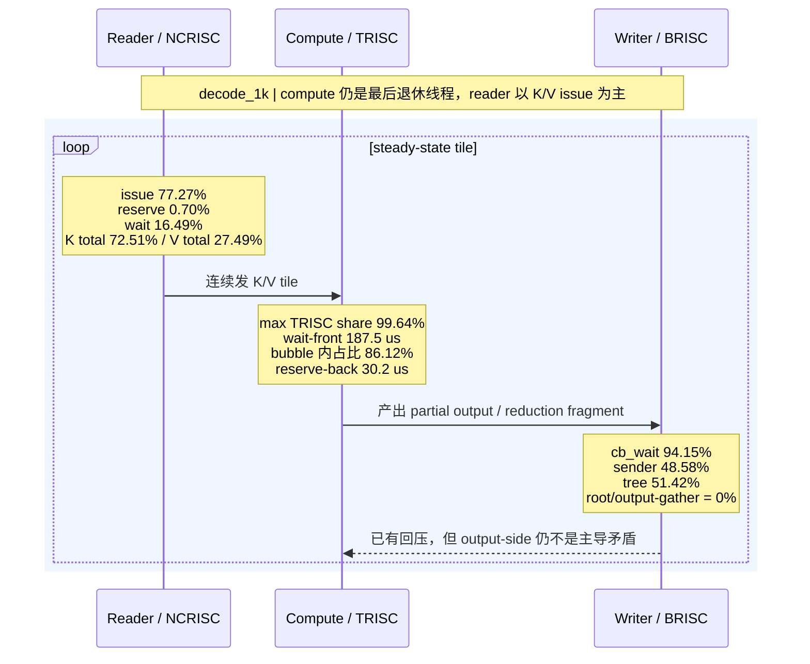
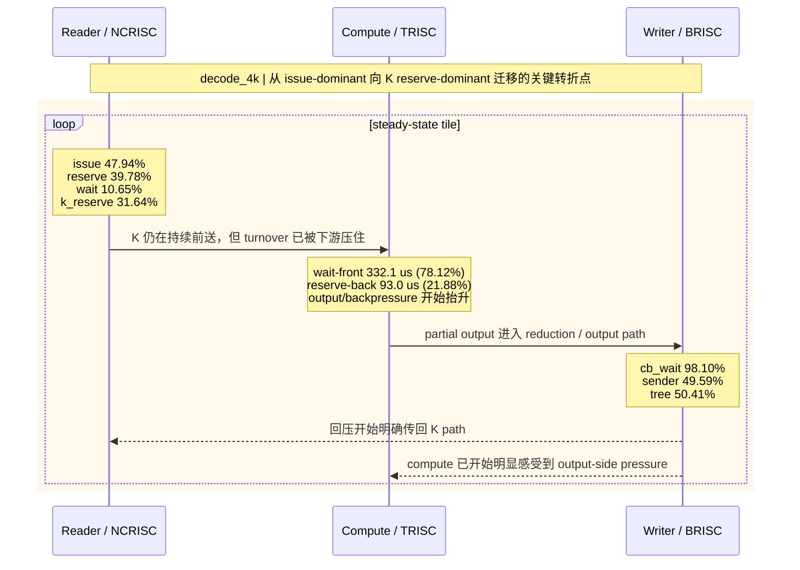
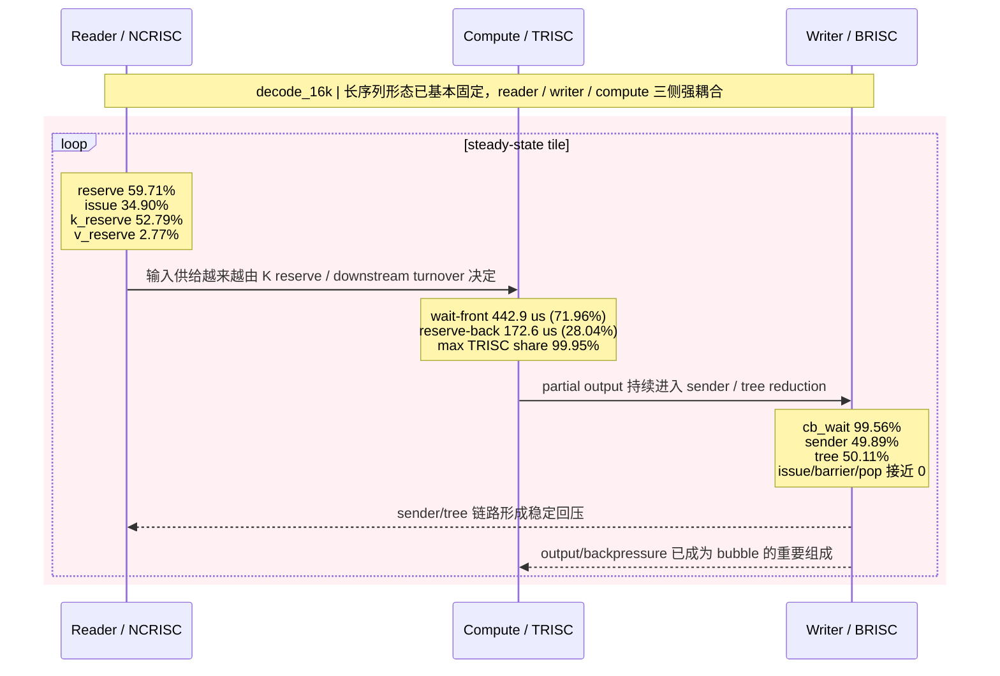
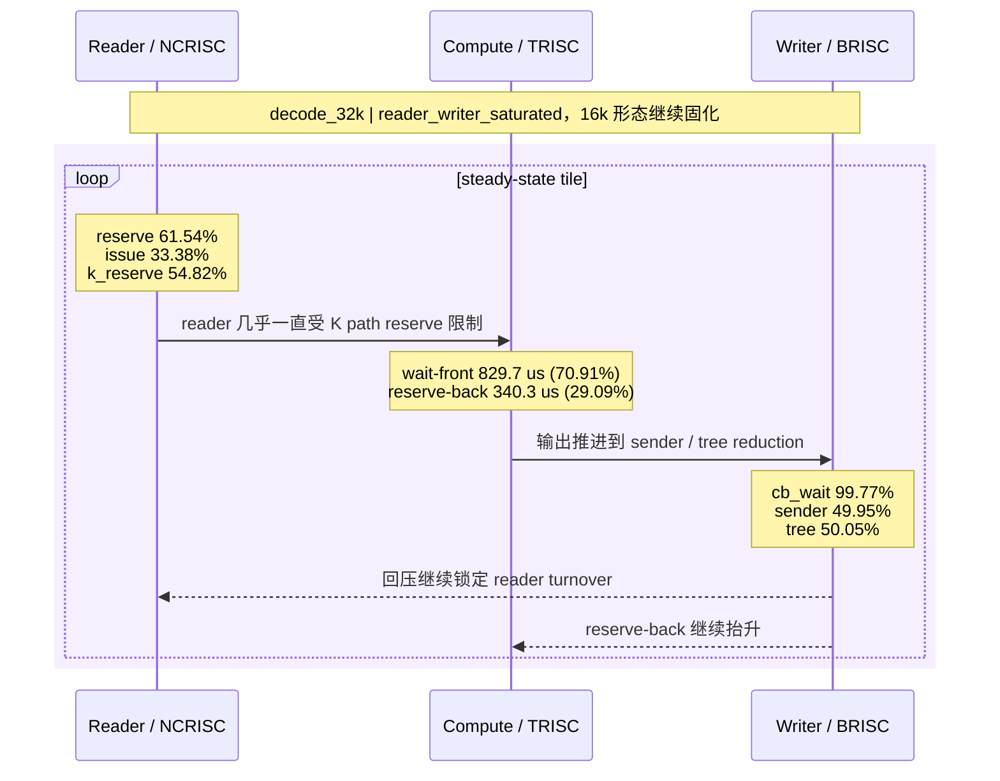
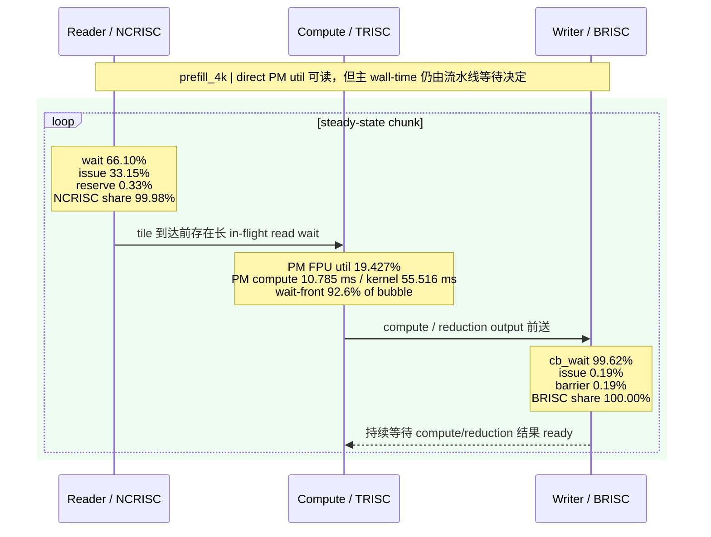

# FlashMLA WH Profile 泳道图

## 1. 使用说明

这份文档把当前 Wormhole 上 FlashMLA 的关键 profile 结果，整理成几张**代表性泳道图**。

读图时请注意：

- 横向时间轴是**概念时序**，不是严格按真实时间比例绘制。
- 泳道分别对应：
  - `Reader / NCRISC`
  - `Compute / TRISC`
  - `Writer / BRISC`
- 图中的百分比来自 profile 的平均 stage share 或 bubble share。
- `wait-front / reserve-back` 仍按 **accumulated stall density** 解读，不直接等价于 wall-time 占比。

这几张图分别对应：

- `decode_1k`：短序列，仍接近 compute-critical
- `decode_4k`：关键迁移点，reader 开始转向 `K reserve`
- `decode_16k`：长序列形态已经基本固定
- `prefill_4k`：direct PM util 可读，适合画完整饱和流水线图

## 2. Decode 短序列：`decode_1k`

### 读图要点

- reader 主要还是在主动发 `K/V` 请求，`reserve` 还很小。
- compute bubble 主要是 `wait-front`，说明 compute 主要在等输入。
- writer 已经明显不轻，但其主等待仍然是内部 `sender/tree` 链路，不是 final gather。

## 3. Decode 迁移点：`decode_4k`

### 读图要点

- `decode_4k` 是最值得关注的迁移点。
- reader 的主状态从 `issue` 快速切到 `issue + reserve` 混合，而且关键新增项是 `k_reserve`。
- compute bubble 中 `reserve-back` 占比开始变大，说明 output/backpressure 成分已经不可忽略。
- writer 已经几乎整段都在 `cb_wait`。

## 4. Decode 长序列：`decode_16k`

### 读图要点

- 到 `decode_16k`，reader 已明确由 `K reserve` 主导，而不是 `V reserve`。
- writer 的主等待仍然不在 final gather，而是在 `sender` 和 `tree child arrival`。
- compute 虽然仍然是满窗线程，但 bubble 里 `reserve-back` 已经接近 `28%`，说明长序列下 output-side pressure 明显增强。

## 5. Decode 极长序列：`decode_32k`

### 读图要点

- `decode_32k` 不是新模式，而是 `decode_16k` 的进一步固化。
- reader / writer / compute 三侧都在贴近 kernel window。
- 如果只说“compute-bound”已经不准确，更准确的是强耦合饱和流水线。

## 6. Prefill 饱和流水线：`prefill_4k`

### 读图要点

- prefill 从一开始就是强耦合流水线，不存在 decode 那种明显的阶段迁移。
- reader 主要在 `wait`，不是在 `reserve`。
- writer 几乎整个窗口都在 `cb_wait`。
- compute thread 虽然几乎满窗，但 direct PM 说明真正算术利用率只有 `19.4%`，所以主矛盾不是“算力不够”，而是流水线等待。

## 7. Prefill PM 曲线对应的泳道解读

`prefill_256 -> prefill_4k` 的 direct PM util 是：

- `10.196% -> 13.904% -> 16.762% -> 18.475% -> 19.427%`

对应的泳道含义是：

- compute 确实越来越“热”，所以 `PM FPU util` 在上升。
- 但 reader `wait` 仍在 `70.30% -> 66.10%`，writer `cb_wait` 仍在 `91.26% -> 99.62%`。
- 这说明 prefill 的性能提升，并不是把流水线等待彻底消掉了，而是在等待仍然占主导的前提下，算术活动比例有所上升。

## 8. 一页总览

### 8.1 Decode 的泳道迁移

- `decode_1k`：reader 以 `K/V issue` 为主，compute 主要看到 `wait-front`
- `decode_4k`：`k_reserve` 第一次大幅抬升，writer `cb_wait` 几乎贴满
- `decode_16k/32k`：reader 由 `K reserve` 主导，writer 稳定卡在 `sender/tree` 两段，compute 的 `reserve-back` 明显增大

### 8.2 Prefill 的泳道形态

- 从 `prefill_256` 开始就已经是 reader / writer / compute 强耦合
- reader 主导项始终是 `wait`
- writer 主导项始终是 `cb_wait`
- compute 的 direct PM util 可读，但仍不足以把 prefill 归类成“纯算力瓶颈”

## 9. 配套文档

更详细的数字分析见：

- `mla_flash_attention_dev/docs/flash-mla-wh-component-utilization-and-bubble-analysis.md`

如果需要看包含：

- 同一个 `S block` 内部
- 不同 `S block` 之间
- 多个 tensix core
- `Host CPU` / `DRAM` / `CB` / `semaphore` 信号

的详细版，请看：

- `mla_flash_attention_dev/docs/flash-mla-wh-detailed-swimlane-diagrams.md`
- `mla_flash_attention_dev/docs/assets/flash-mla-wh-profile-swimlanes-detailed/`
