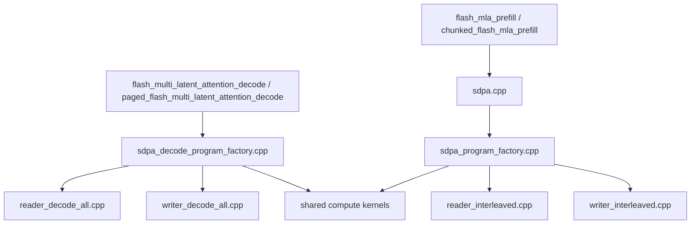
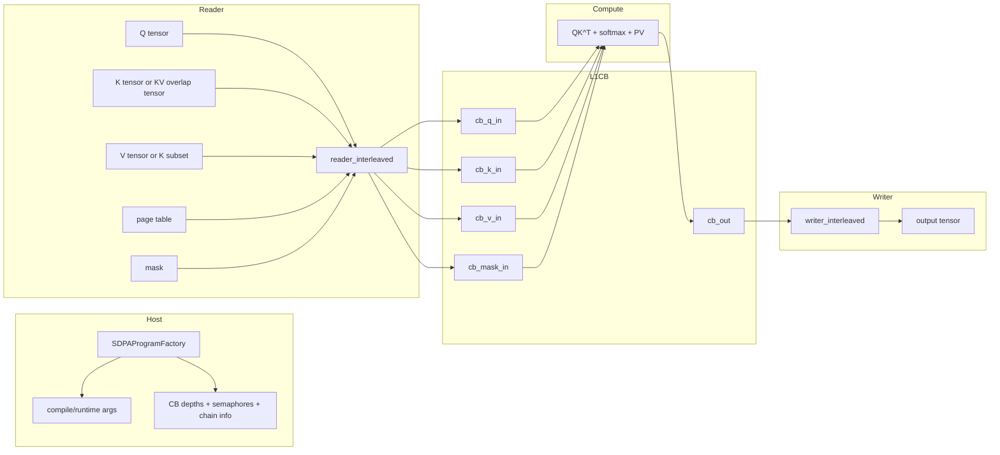
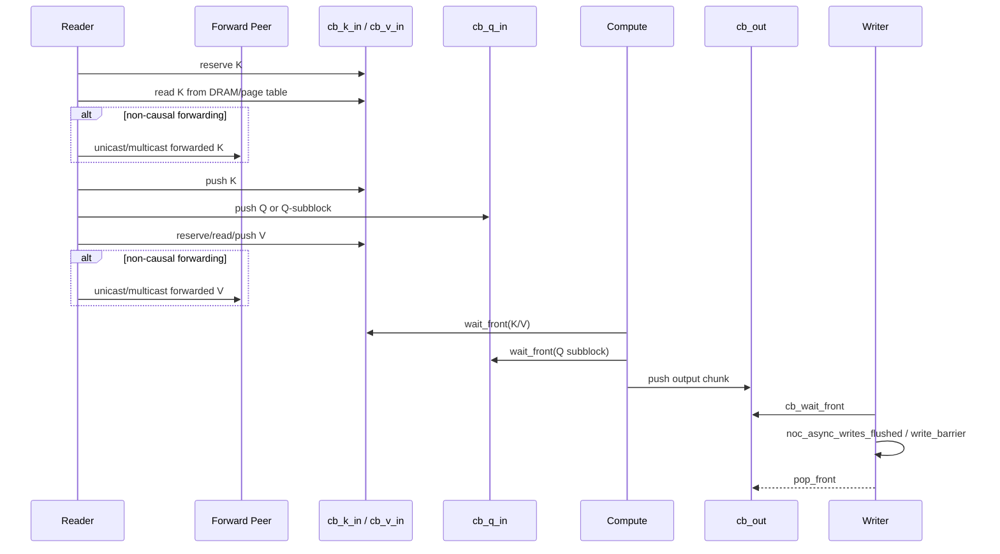
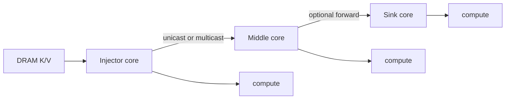
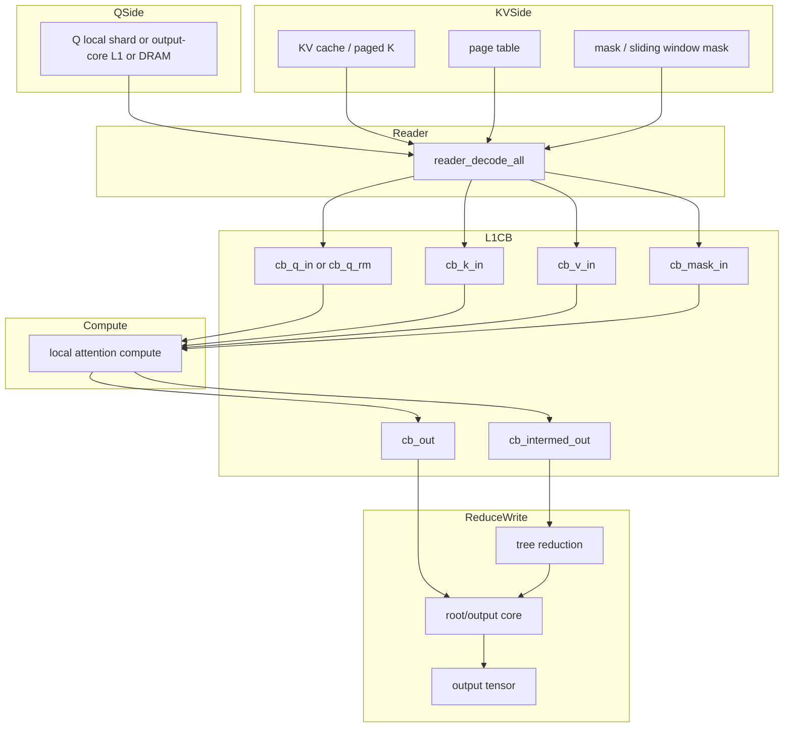
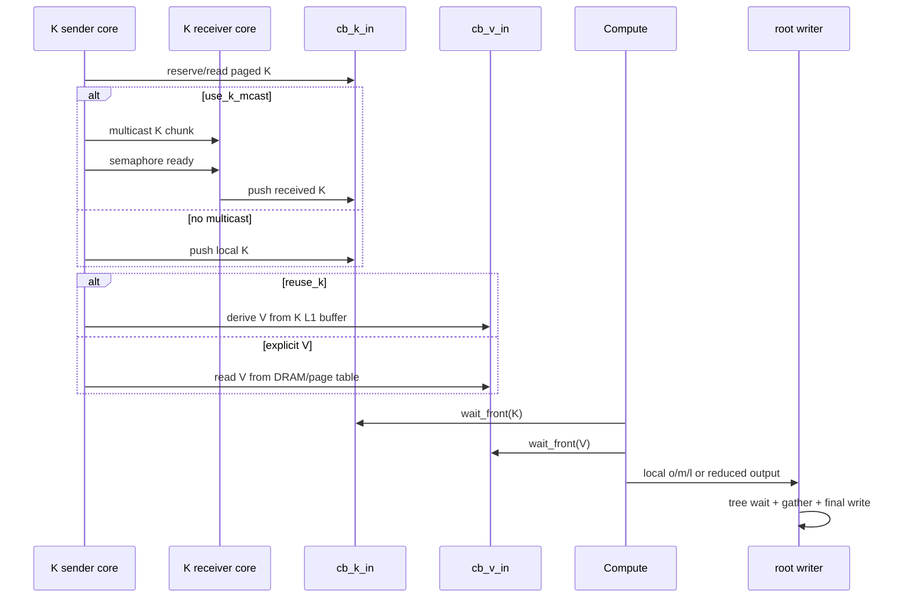
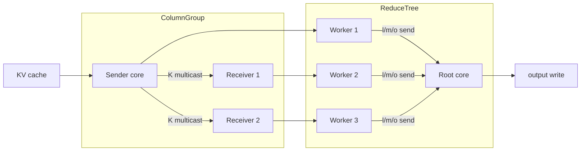

# Flash MLA 现有数据流分析与优化建议

## 1. 文档目的

这份文档聚焦当前仓库里已经接入 `ttnn` 主线的 Flash MLA 数据流，目标是回答四个问题：

1. 当前 `prefill` 和 `decode` 分别走哪条 host/device 路径
2. reader / compute / writer 之间到底如何搬运数据、如何同步
3. 现有 profiling 里看到的 `reader reserve`、`writer cb_wait`、`K multicast` 等现象，对应代码里的哪一段
4. 站在现有实现上，哪些优化点最值得优先做

这里讨论的是当前主线的两条 MLA-aware attention 路径：

- `ttnn.transformer.flash_mla_prefill`
- `ttnn.transformer.chunked_flash_mla_prefill`
- `ttnn.transformer.flash_multi_latent_attention_decode`
- `ttnn.transformer.paged_flash_multi_latent_attention_decode`

不把 `models/demos/deepseek_v3_b1/micro_ops/flash_mla/` 里的实验性 fused kernel 当作本文主对象。

## 2. 关键文件

### 2.1 Prefill

- `ttnn/cpp/ttnn/operations/transformer/sdpa/sdpa.cpp`
- `ttnn/cpp/ttnn/operations/transformer/sdpa/device/sdpa_program_factory.cpp`
- `ttnn/cpp/ttnn/operations/transformer/sdpa/device/kernels/dataflow/dataflow_common.hpp`
- `ttnn/cpp/ttnn/operations/transformer/sdpa/device/kernels/dataflow/reader_interleaved.cpp`
- `ttnn/cpp/ttnn/operations/transformer/sdpa/device/kernels/dataflow/writer_interleaved.cpp`

### 2.2 Decode

- `ttnn/cpp/ttnn/operations/transformer/sdpa_decode/device/sdpa_decode_program_factory.cpp`
- `ttnn/cpp/ttnn/operations/transformer/sdpa_decode/device/kernels/dataflow/dataflow_common.hpp`
- `ttnn/cpp/ttnn/operations/transformer/sdpa_decode/device/kernels/dataflow/reader_decode_all.cpp`
- `ttnn/cpp/ttnn/operations/transformer/sdpa_decode/device/kernels/dataflow/writer_decode_all.cpp`

### 2.3 Profiling / 分析文档

- `mla_flash_attention_dev/experiments/flash_mla_wh_profile_and_bh_simulation.md`
- `mla_flash_attention_dev/experiments/profile_outputs/flash_mla_wh_detailed/flash_mla_utilization_and_bubble_report.md`
- `mla_flash_attention_dev/experiments/flash_mla_pm_and_bubble_min_rerun_plan.md`

## 3. 一句话总结

当前主线 Flash MLA 的本质不是一个完全独立的新 attention 栈，而是：

- `prefill` 复用 `sdpa` 主栈，通过 `use_mla`、`head_dim_v`、`mla_kv_overlap` 切到 MLA 语义
- `decode` 复用 `sdpa_decode` 主栈，通过 `use_mla`、`reuse_k`、`q_locally_available`、`use_k_mcast` 切到 MLA 语义
- 真正的热点不在 Python wrapper，而在 program factory 的并行/CB/拓扑配置，以及 reader/writer kernel 的数据搬运和同步

从 profiling 看：

- `prefill` 从很早开始就是 `reader + writer + compute` 强耦合饱和流水线
- `decode` 短序列偏 compute-critical，但中长序列会先进入 writer 贴边，再进入 reader/writer 双贴边
- 长序列 decode 的关键问题不是“写带宽纯打满”，而是 `reader reserve` 和 `writer cb_wait` 代表的 backpressure 在流水线中传递

## 4. 顶层结构图

可以把这张图理解成：

- host 侧的关键职责是“如何切分并行、如何布置 CB、如何设置 semaphore、如何给 kernel 传 compile/runtime args”
- device 侧的关键职责是“如何把 Q/K/V/mask/page_table 正确搬进 L1，并在 compute / reduce / output 之间形成流水线”

## 5. Prefill 数据流

### 5.1 Host 侧如何进入 prefill 路径

当前 MLA prefill 不是单独的新 primitive，而是通过 `sdpa.cpp` 最终进入 `ttnn::prim::sdpa(...)`。

这一层最重要的 MLA 语义开关是：

- `use_mla = true`
- `head_dim_v = ...`
- `mla_kv_overlap = use_mla && !tensor_args.v.has_value()`

也就是说，host 已经承认一种重要语义：

- `V` 可能根本不单独提供
- 这时会把 `K` 当作底层源 tensor，同时由 MLA 逻辑决定只取其中一部分列作为 `V`

`sdpa_program_factory.cpp` 的职责包括：

- 决定 `batch / head / q chunk` 的并行划分
- 创建 reader / compute / writer 所需的 circular buffers
- 在 non-causal 场景下构建 `KV chain forwarding` 链路
- 决定是否允许 multicast
- 生成 compile-time args 和 runtime args

### 5.2 Prefill 顶层数据流图

#### 5.2.1 Prefill 单个 K/V chunk 的时序图

这个时序图里最重要的两点是：

- prefill reader 不是简单“Q/K/V 全部读完再算”，而是会尝试利用 `Q subblock push` 和 forwarding 形成交叠
- 但由于 outstanding writes 和后续 `noc_async_read_barrier()` 之间存在严格顺序约束，prefill 的流水线顺序没有表面上看起来那么自由

### 5.3 Reader 具体做了什么

#### 5.3.1 Q 路径

prefill reader 会把 `Q` 按 chunk 读入 `cb_q_in`，有两种形态：

- 普通整块 push
- `q_subblock_h` 驱动的 `Q subblock push`

`Q subblock push` 的目的不是改变数学，而是更细粒度地把 `Q` 分段送给 compute，以便让 `Q` read 和后续 compute 交叠。

#### 5.3.2 K 路径

`K` 被读入 `cb_k_in`，而且在 reader 中会直接转成更适合 `QK^T` 的布局。

关键点有两个：

- 非 paged 路径可以走 `read_chunk_with_padding(...)`
- paged/chunked 路径会走 `read_paged_chunk_with_padding(...)`

non-causal prefill 里还有一个很重要的优化分支：

- `KV chain forwarding`

也就是一个 core 从 DRAM 把 `K` 读到本地 L1 后，再通过 `noc_async_write` 或 `noc_async_write_multicast` 转发给链路上的下一批 core，而不是让所有 core 各自回 DRAM 重读。

#### 5.3.3 V 路径

当前 prefill 的 `V` 路径有 MLA 特化，但还不够彻底：

- 如果 `mla_kv_overlap = false`，`V` 从独立的 `V tensor` 读取
- 如果 `mla_kv_overlap = true`，`V` 仍然会从底层源 tensor 再读一遍，只是通过 `skip_src_cols` 跳过不属于 `V` 的列

换句话说，当前 prefill 已经知道：

- `V` 逻辑上是 `K` 的一个子视图

但它还没有像 decode 那样做到：

- 先把 `K` 读到 L1
- 再直接从 `K` 的 L1 buffer 派生出 `V`

这会直接影响后面的优化优先级。

#### 5.3.4 Page table / mask / chunk start

chunked prefill 下 reader 还要承担三类辅助控制流：

- 每个 batch 读取 page table
- 读取或生成 mask
- 如果使用 flexible chunking，还会把 `chunk_start_idx` 读入两个不同 CB，分别给 compute 和 writer 用

这里的特点是：

- page table 当前是“读完即 barrier”
- `chunk_start_idx` 当前存在重复读取
- mask 读取/补零本身不是主算，但会参与 reader 的 barrier 节奏

### 5.4 Prefill 的 forwarding / multicast 设计

prefill 的转发链更像“store-and-forward”：

这个设计解决的是“所有 core 都回 DRAM 读同一份 K/V”的问题，但它也引入了新的同步责任：

- sender 必须等 receiver semaphore
- linked multicast 和 companion semaphore 的顺序必须严格正确
- outstanding NOC writes 和后续 `noc_async_read_barrier()` 之间存在死锁规避要求

因此在 `reader_interleaved.cpp` 里可以看到一个很不寻常但很关键的顺序约束：

- 先完成 K forward
- 再开始 `Q subblock push`

这是为了避免读 barrier 和仍在飞行中的写事务相互卡住。

### 5.5 Prefill writer 做了什么

prefill writer 的工作相对直接：

1. `cb_wait_front(cb_out, out_chunk_tiles)`
2. 把 output tile 写到目标 tensor
3. 按 `barrier_threshold` 触发 `noc_async_writes_flushed()`
4. 最后 `noc_async_write_barrier()`
5. `cb_pop_front(cb_out, out_chunk_tiles)`

虽然 writer 逻辑不复杂，但 profiling 很清楚地表明：

- prefill writer 大部分时间不在 issue 自己的写事务
- 它绝大部分时间都卡在 `cb_wait_front`

这说明 prefill writer 的主要问题不是“单个 write API 太慢”，而是上游产出和下游消费之间的节拍已经耦合得很紧。

### 5.6 Prefill 的 profiling 对应解释

当前 prefill 的经验结论可以直接和代码对上：

- `reader` 主导项是 `wait`
- `writer` 主导项是 `cb_wait`
- 全路径从很短的序列开始就接近饱和

这对应的工程含义是：

- prefill 更像“高流量饱和数据流”
- 不是“先算不动，再考虑搬运”
- 如果只盯 compute fidelity，而不盯 reader/writer/CB depth/转发路径，收益通常不会最大

## 6. Decode 数据流

### 6.1 Host 侧如何进入 decode 路径

decode 侧的 MLA 语义比 prefill 更成熟，核心参数包括：

- `use_mla`
- `head_dim_v`
- `reuse_k`
- `q_locally_available`
- `use_k_mcast`

最关键的 host 侧逻辑发生在 `sdpa_decode_program_factory.cpp`：

- 如果 `Q` 是 sharded 且在 MLA 场景下已经复制到多个 worker，就设置 `q_locally_available`
- 当 `q_heads_parallel_factor > 1` 且 `q_locally_available` 时，使用 `use_col_major_group_indexing`
- 在这种 group 布局下，K 可以沿列做 multicast
- reduction 侧会建立 tree reduction 拓扑

也就是说，decode 的 host 逻辑已经不是“只把 kernel 拉起来”，而是在主动为：

- `Q local replicate`
- `K multicast`
- `tree reduction`
- `root/output core`

这几件事做空间布局。

### 6.2 Decode 顶层数据流图

#### 6.2.1 Decode 单个 K chunk 的时序图

decode 的时序和 prefill 最大的差异是：

- `Q` 经常已经在本地，不再是主搬运对象
- `K` 的重用主要靠 multicast
- `V` 的重用主要靠 `reuse_k`
- writer 不是简单 write-back，而是包含 reduction 协议

### 6.3 Reader 具体做了什么

#### 6.3.1 Q 路径

decode reader 的 `Q` 路径比 prefill 更分层：

- 如果 `q_locally_available = true`，reader 基本不搬 Q，只做 `reserve + push`
- 如果 `Q` 是 sharded 但不在本地，就从 output core 的 L1 读取
- 如果 `Q` 不 sharded，就从 DRAM 读取

这意味着 decode 在 MLA 场景下已经明确利用了一个事实：

- `Q` 是单 token 或很小的片段
- 与其让每个 worker 再去 DRAM 取，不如尽量把 Q 预先布到对的位置

#### 6.3.2 K 路径

decode 的 `K` 路径是 paged attention 的核心：

- 根据 page table 做 `virtual -> physical tile` 映射
- 把 K chunk 读入 `cb_k_in`
- 同时转成适合 compute 的布局

如果开启 `use_k_mcast`，则 sender core 会：

1. 自己从 paged KV cache 读入完整的 K chunk
2. 用 `noc_async_write_multicast(...)` 把整块 K 发给同列的 receiver
3. 用 semaphore 通知 receiver 数据 ready

receiver core 则不会重复从 DRAM 读 K，而是：

- 等 semaphore
- 直接 `cb_push_back(cb_k_in, ...)`

这就是 decode 中 `K multicast` 的真正含义。

#### 6.3.3 V 路径

decode 的 MLA 特化最彻底的地方就在这里：

- 如果 `reuse_k = true`，reader 不会再去 DRAM 读 V
- 它会直接从 `K` 已经读进 L1 后的 buffer 中，用 `k_base_read_ptr` 把 `V` 对应的列拷出来

这一步非常重要，因为它把：

- “MLA 里 V 是 K 的一部分”

从 host 语义真正落实成了：

- “只读一次底层源数据，再在 L1 内派生出 V”

因此 decode 和 prefill 的一个本质差别是：

- decode 已经具备 `reuse_k`
- prefill 还停留在“知道 overlap，但仍然二次读 V”的阶段

#### 6.3.4 Mask / sliding window / attention sink

decode reader 还承担：

- causal mask 生成
- sliding window mask 生成
- attention sink 读取

这一段的特点是：

- mask 不是从 host 预先准备好所有 tile，而是在 device 侧大量做模板填充和复制
- 同一套 tile 会在多个 head 上复制
- 中间会穿插较多 `noc_async_read_barrier()`

这不是 decode 的主瓶颈，但在长链路里会放大 reader 的控制开销。

### 6.4 Decode 的 K multicast / tree reduction 示意图

这张图有两个关键含义：

- K 的数据复用主要发生在 reader 之前的 multicast 阶段
- output 的汇总主要发生在 writer 之前的 tree reduction 阶段

因此 decode 的热点天然会落在：

- sender hotspot
- reducer/root wait
- output gather / partial write

### 6.5 Decode writer 做了什么

decode writer 比 prefill writer 复杂得多，因为它不只负责写结果，还负责 reduction 协议。

#### 6.5.1 非 root sender

worker 在本地 compute 完后，要把：

- `l`
- `m`
- `o`

按顺序写到父节点的 `cb_intermed_out` 区域，然后用 semaphore 通知父节点。

#### 6.5.2 中间或 root 节点

父节点会：

- 按 round 轮询 nibble 编码的 semaphore
- 收到 child 的数据后，把 `l/m/o` 读回本地 CB
- 交给 compute 做归并

#### 6.5.3 最终输出

root 节点最后才负责写 output：

- 如果是简单 MQA，可以整 tile 写出
- 如果是 GQA，可能需要 `write_partial_tiles_to_memory(...)`
- 如果 output 是 sharded，还可能需要从其它 reducer 再 gather 一轮结果

这就是为什么 decode writer 的真实等待来源很多：

- `cb_wait_front`
- child wait
- root wait
- output gather wait

### 6.6 Decode 的 profiling 对应解释

profiling 里看到的现象和代码非常一致：

- `decode_256 ~ 1k`：compute 还没完全退休
- `decode_2k ~ 8k`：writer 贴边，但内部大部分时间在 `cb_wait_front`
- `decode_16k ~ 32k`：reader 也贴边，而且 `cb_reserve_back` 明显抬升

这说明 decode 长序列的主要问题是：

- reader 越来越等下游腾空间
- writer 越来越等上游把结果送到输出 CB
- 两种等待通过 CB 和 reduction 协议彼此传导，形成强耦合流水线

## 7. 当前实现里的同步原语、CB 与 profile marker

| 原语 | 位置 | 代表的真实含义 |
|---|---|---|
| `cb_reserve_back` | reader / 生成端 | 生产者在等下游释放空间；share 上升通常表示 backpressure |
| `cb_push_back` | reader / compute / writer 前 | 把新数据暴露给下游 |
| `cb_wait_front` | compute / writer / sender | 消费者在等上游产出数据；writer `cb_wait` 高通常表示 output availability bound |
| `cb_pop_front` | consumer 侧 | 消费完释放空间 |
| `noc_async_read_barrier` | reader / mask 生成 | 等一批 read 请求完成；太频繁会打断大块搬运 |
| `noc_async_writes_flushed` | writer | 做分批 flush，控制 in-flight write 深度 |
| `noc_async_write_barrier` | writer / sender | 等写事务全部完成 |
| `noc_semaphore_wait/set/inc` | forwarding / multicast / tree reduction | 在 core 之间做“数据 ready”握手 |

这个表很重要，因为 profiling 里的很多“阶段占比”并不是抽象概念，而是这些原语的时间累积。

### 7.1 Prefill 关键 CB / semaphore 速查表

| 名称 | 位置 | 作用 |
|---|---|---|
| `cb_q_in = c_0` | `reader_interleaved.cpp` | 存放 Q chunk 或 Q subblock，供 compute 消费 |
| `cb_k_in = c_1` | `reader_interleaved.cpp` | 存放 K chunk，必要时也是 forwarding 的源地址 |
| `cb_v_in = c_2` | `reader_interleaved.cpp` | 存放 V chunk；当前 MLA overlap 仍会单独填充 |
| `cb_mask_in = c_3` | reader/writer | 用户 mask 或生成 mask 的输入 buffer |
| `cb_attention_sink = c_4` | `reader_interleaved.cpp` | attention sink tile 缓冲 |
| `cb_id_page_table = c_6` | `reader_interleaved.cpp` | chunked/paged prefill 的 page table scratch buffer |
| `cb_id_chunk_start_idx_compute = c_8` | `reader_interleaved.cpp` | 给 compute 使用的 chunk start index |
| `cb_id_chunk_start_idx_writer = c_9` | `reader_interleaved.cpp` / `writer_interleaved.cpp` | 给 writer 使用的 chunk start index |
| `cb_out = c_16` | `writer_interleaved.cpp` | compute 写出的 output chunk，writer 从这里 wait/pop |
| `sender/receiver/valid semaphore` | prefill forwarding 路径 | 保障 unicast/multicast 的 ready/ack 顺序 |

### 7.2 Decode 关键 CB / reduction buffer 速查表

| 名称 | 位置 | 作用 |
|---|---|---|
| `cb_q_in = c_0` | `reader_decode_all.cpp` | tilized Q 输入 |
| `cb_q_rm = c_10` | `reader_decode_all.cpp` | row-major Q 暂存，供 tilize 路径使用 |
| `cb_k_in = c_1` | `reader_decode_all.cpp` | K chunk；sender 也用它作为 multicast 源 |
| `cb_v_in = c_2` | `reader_decode_all.cpp` | V chunk；在 MLA 下可由 `reuse_k` 生成 |
| `cb_mask_in = c_3` | reader/writer | causal 或显式 mask buffer |
| `cb_attention_sink = c_4` | `reader_decode_all.cpp` | attention sink 缓冲 |
| `cb_id_page_table = c_9` | `reader_decode_all.cpp` | paged decode 的 page table scratch buffer |
| `cb_out = c_20` | `writer_decode_all.cpp` | root 最终输出 buffer |
| `cb_intermed_out = c_19` | `writer_decode_all.cpp` | child 写给 parent 的中间归约区 |
| `cb_out_worker = c_16` | `writer_decode_all.cpp` | worker 本地输出 `o` buffer |
| `cb_out_m = c_17` | `writer_decode_all.cpp` | worker 本地 `m` buffer |
| `cb_out_l = c_18` | `writer_decode_all.cpp` | worker 本地 `l` buffer |
| `cb_l_in = c_7` / `cb_m_in = c_6` / `cb_out_o = c_16` | `writer_decode_all.cpp` | parent 读取 child 的 `l/m/o` 后再交给 compute 做归并 |
| `k_mcast_semaphore_id` | decode reader | K multicast sender/receiver 同步 |
| `reducer_semaphore_addr` | decode writer | tree reduction 每轮 child-ready 信号 |
| `output_semaphore_addr` | decode writer | sharded output gather 完成通知 |

### 7.3 Profile marker 到代码阶段的映射

| profile 指标 | 主要对应代码动作 | 工程解释 |
|---|---|---|
| `reader reserve/block` | `cb_reserve_back(cb_k_in/cb_v_in/...)` | reader 在等下游释放空间，通常是典型 backpressure |
| `reader issue` | `noc_async_read_tile` / `noc_async_read` 循环 | reader 正在主动发请求，说明还偏搬运驱动 |
| `reader wait` | `noc_async_read_barrier`、`noc_semaphore_wait` | 等 in-flight read 或等远端 ready |
| `reader push` | `cb_push_back(...)` | 搬运完成后向 compute 暴露数据 |
| `writer cb_wait` | `cb_wait_front(cb_out/...)` | writer 等上游产出 output，通常不是纯写带宽问题 |
| `writer issue` | `noc_async_write_tile` / `noc_async_write` | 真正写事务的发起开销 |
| `writer barrier` | `noc_async_writes_flushed` / `noc_async_write_barrier` | 等写完成、控制 in-flight write 深度 |
| `writer pop` | `cb_pop_front(...)` | output 被消费后释放空间 |
| `tree child wait` | decode writer 轮询 round semaphore | reduction 树上的 child 尚未产出 |
| `output gather wait` | `noc_semaphore_wait(output_semaphore_addr_ptr, ...)` | sharded 输出还在等其它 reducer |
| `DEVICE COMPUTE CB WAIT FRONT` | compute 侧输入等待 | 更偏向输入未 ready 或阶段节拍错配 |
| `DEVICE COMPUTE CB RESERVE BACK` | compute 侧输出/中间 buffer 等待 | 更偏向 output/backpressure 传导 |

### 7.4 如何把 profile 结果映射回现有结论

把 profiling 文档和当前实现放在一起看，可以得到一个很稳定的解释框架：

- `prefill` 的 `reader wait` 高，说明它更像“高流量搬运 + completion wait”主导
- `decode` 的 `reader reserve` 高，说明它更像“下游不够快，reader 被顶住”
- `writer cb_wait` 高不等于写 NoC 已满，而是 writer 在等 compute/reduction 把结果送到 output CB
- `K multicast` 成为瓶颈时，重点不在 DRAM，而在 sender core、multicast 路径和随后的 reduction 链条

## 8. 现有数据流最值得优先优化的点

### 8.1 高优先级：把 prefill 的 `mla_kv_overlap` 推进成真正的 `reuse_k`

#### 现状

当前 prefill 已经知道：

- `V` 可能和 `K` 共用底层源 tensor

但实际 reader 还是把 `V` 再读一遍，只是用了 `skip_src_cols` 去裁掉不需要的列。

#### 问题

这会导致两类浪费：

- 对 DRAM 或底层 tensor 的重复读取
- 如果开启 forwarding，还会把 `V` 也作为独立 payload 再转发一遍

#### 建议

把 prefill 改成 decode 风格：

1. 先把 `K` 读到 `cb_k_in`
2. 从 `K` 的 L1 buffer 中直接派生 `V`
3. 如果链路允许，只 forward `K`
4. 接收方在本地从 `K` 重建 `V`

#### 预期收益

- 降低源数据重复读取
- 降低 non-causal forwarding 路径上的 `V` 转发流量
- 让 prefill 和 decode 的 MLA 语义更一致

#### 风险点

- prefill 中 `K` 和 `V` 在 compute 前的排布不完全一样
- 需要确认 `K` 的 L1 布局是否足够高效地支撑 `V` 的派生访问

### 8.2 高优先级：优先调 decode 的 CB 深度和 page pipeline，而不是先抠 compute

#### 现状

decode 长序列的经验瓶颈是：

- reader `cb_reserve_back`
- writer `cb_wait_front`

#### 含义

这说明 decode 的根因更接近：

- buffer turnover 不够快
- page pipeline 深度不足
- producer / consumer 节拍不匹配

#### 建议

优先 sweep 和建模这些参数：

- `k_cb_depth`
- `v_cb_depth`
- `pipeline_depth`
- `trid_window`
- `k_page_size_bytes`

#### 预期收益

- 减少 reader reserve stall
- 改善 page overlap
- 让 compute 和 writer 不那么容易互相卡住

#### 配套方法

优先盯这些 case：

- `decode_4k`
- `decode_16k`
- `decode_32k`

因为它们正好跨过了 writer-close 到 reader-close 的迁移区。

### 8.3 高优先级：优化 decode writer 的 reduction 和输出写回路径

#### 现状

当前 decode writer 的复杂度主要来自：

- tree reduction
- root wait
- GQA partial write
- sharded output gather

#### 问题

这使得 writer 的 `cb_wait` 虽然表面上看像“等数据”，但背后其实混合了：

- reduce 还没完成
- root 还没 gather 完
- partial tile 写回粒度太碎

#### 建议

优先考虑三类方向：

1. 让 reduction 更流式，而不是整块等 `l/m/o` 都 ready
2. 尽量把 GQA 输出布局往整 tile 写回方向靠
3. 如果必须 partial write，尽量减少每 head 的小包 NOC 事务数

#### 预期收益

- 降低 writer `cb_wait`
- 降低 root wait / output gather wait
- 减少写回侧的小事务开销

### 8.4 高优先级：控制 `K multicast` sender hotspot

#### 现状

decode 里 `K multicast` 是非常值得保留的设计，因为它减少了 DRAM 重读。

#### 问题

但热点会集中在少量 sender core 上，尤其在：

- `q_locally_available = true`
- `q_heads_parallel_factor > 1`
- 同列有多个 receiver

时更明显。

#### 建议

可以考虑：

- 按 workload 条件决定是否开启 `use_k_mcast`
- 在更大 group 下改成两级 multicast / tree fanout
- 把 sender hotspot 作为 autotuner 的显式代价项继续强化

#### 预期收益

- 降低 sender 局部过热
- 避免 multicast 反而把 critical path 推到少数 core 上

### 8.5 中优先级：消除 prefill 里的控制流小浪费

可以顺手处理的点包括：

- `chunk_start_idx` 目前被读入两个不同 CB，可合并为一次读取后共享
- page table 读取当前是“读完即 barrier”，可以评估是否能更好地和 K 第一批事务重叠
- mask/template 生成里有较多本地复制和 barrier，可评估是否能做模板常驻或按 head 共享

这些点通常不会像 `reuse_k` 或 reduction 重构那样大幅改变曲线，但实现风险低，适合作为清理项。

### 8.6 中优先级：重新校准 barrier 粒度

当前很多 reader / writer 路径都依赖统一的 `barrier_threshold`。

潜在问题是：

- tile size、stream 类型、forwarding 方式不同，但 barrier 粒度并不完全差异化
- 太频繁的 barrier 会削弱大块搬运效率
- 太稀疏的 barrier 又可能加大尾延迟和 L1/NOC 压力

更合适的做法是：

- 至少区分 `Q/K/V/mask/writeback` 的 barrier 节奏
- 把 barrier 粒度当作可调参数，而不是固定从单一公式推导

## 9. 优化优先级排序

如果只按“收益 / 风险 / 与现有瓶颈对齐程度”排序，我建议：

1. prefill `mla_kv_overlap -> reuse_k`
2. decode 的 `CB depth / pipeline depth / trid window / page size` 调优
3. decode writer 的 reduction / partial write / gather 优化
4. `K multicast` sender hotspot 控制
5. `chunk_start_idx`、mask、page table、barrier 这些中小清理项

## 10. 建议的验证方法

为了避免只改代码不验证，我建议每个优化都至少盯一组代表点：

### 10.1 Decode

- `decode_1k`
- `decode_4k`
- `decode_32k`

重点看：

- `reader reserve share`
- `writer cb_wait share`
- `DEVICE COMPUTE CB WAIT FRONT`
- `DEVICE COMPUTE CB RESERVE BACK`
- sender / root / output gather 相关的 writer marker

### 10.2 Prefill

- `prefill_1k`
- `prefill_4k`

重点看：

- reader `wait share`
- writer `cb_wait share`
- K/V 源读取字节数
- forwarding 路径流量是否下降

## 11. 结论

当前 TT 主线 Flash MLA 的数据流已经不是“能不能跑”的阶段，而是“如何把已有主线的 reader / writer / 拓扑利用得更好”的阶段。

从实现成熟度上看：

- decode 的 MLA 语义已经更完整，尤其是 `reuse_k`、`q_locally_available`、`K multicast`、`tree reduction`
- prefill 仍然有明显的结构性优化空间，最典型的就是 `mla_kv_overlap` 还没有真正做到 L1 内 `reuse_k`

从性能症状上看：

- prefill 更像高流量饱和数据流
- decode 更像中长序列下由 backpressure 传播锁住的深流水系统

所以后续优化最值得优先做的，不是盲目继续榨 compute，而是：

- 先减少不必要的数据搬运
- 再改善 CB 周转和 page pipeline
- 最后处理 reduction / multicast 热点
