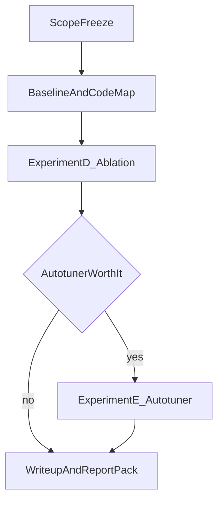

# Tenstorrent MLA + Flash Attention 下一阶段执行计划

## 1. 文档目的

这份文档用于把当前的研究想法收敛成一条可执行的项目路线，目标不是继续扩展方向，而是明确：

- 接下来优先做什么
- 哪些内容先不做
- 每个阶段的产出是什么
- 什么时候进入下一阶段

本文默认基于以下已有材料继续推进：

- `tenstorrent-mla-expanded-roadmap.md`
- `ref/tt-metal_kv_forwarding_iccad_experiment_plan.md`
- `ref/tt-metal_kv_forwarding_design_space_autotuner.md`
- `ref/NoC_与多播代码实现详解.md`
- `dev_log.md`

---

## 2. 总体策略

当前不适合同时把 `MLA 应用`、`NoC/多播优化`、`autotuner`、`decode`、`multi-chip` 全部并行推进。

接下来应采用一条更稳妥的主线：

1. 先固定一个最容易形成闭环的优化主战场
2. 先拿到稳定的 baseline 和优化项消融结果
3. 再决定 autotuner 是主贡献还是次要章节
4. 最后把内容整理成技术报告或论文故事

一句话版本：

**先把 `single-chip non-causal prefill` 做深做实，再决定是否把 autotuner 升级为主贡献。**

---

## 3. 默认决策

为避免后续反复摇摆，当前先默认采用下面这些决策：

### 3.1 主线场景

- 第一阶段主线：`single-chip non-causal prefill`
- 第一阶段背景：`MLA + Flash Attention`
- 第一阶段重点：`KV forwarding / multicast / layout / pipeline / NoC`

### 3.2 次要场景

- `decode`：作为应用背景与后续扩展，不作为第一阶段核心工程主线
- `multi-chip`：先不作为主目标，只保留为后续扩展方向

### 3.3 autotuner 定位

- 第一阶段先把 autotuner 视为 `offline / cached policy selector`
- 不默认把它写成在线实时搜索
- 只有在 `oracle gap` 和 `search overhead` 足够有说服力时，才升级为主贡献

### 3.4 评估重点

第一阶段优先关注下面这些指标：

- latency
- speedup vs `NC-current-auto`
- speedup vs `NC-naive`
- NoC bytes
- DRAM utilization
- injector stall
- receiver idle
- correctness / stability

---

## 4. 项目路线图

---

## 5. 阶段计划

| 阶段 | 时间建议 | 主要目标 | 核心输出 |
| --- | --- | --- | --- |
| Phase 0 | `2-3` 天 | 冻结范围与 workload | `scope note`、workload family 列表 |
| Phase 1 | `1` 周 | 建 baseline 和代码地图 | baseline 说明、代码路径图、测试入口 |
| Phase 2 | `2-3` 周 | 做优化项消融 `D` | 消融结果、profiler 证据、阶段结论 |
| Phase 3 | `1-2` 周 | 决定 autotuner 级别 | `oracle gap`、搜索开销、是否升级 |
| Phase 4 | `1` 周 | 整理成报告或论文包 | 图表清单、主结论、报告草稿 |

---

## 6. Phase 0：冻结范围

### 6.1 目标

把“想做很多事”收敛成“先做一条主线”。

### 6.2 要完成的事

- 明确第一阶段只围绕 `single-chip non-causal prefill` 展开
- 明确 `decode` 不作为第一阶段主战场
- 明确 `multi-chip` 暂不纳入第一阶段必须项
- 把 workload 按 family 分类
- 固定第一阶段的主指标和对照基线

### 6.3 建议的 workload family

- `F1`：当前主形状
- `F2`：更长序列
- `F3`：`GQA / MQA` 变化
- `F4`：不利布局、尾部不均匀、`mcast` 不可用的 stress case

### 6.4 退出标准

满足下面三条即可结束本阶段：

- 能用一句话说清第一阶段主线
- 能列出第一批代表 workload
- 能说明哪些内容暂时不做

### 6.5 当前产物

本阶段对应的范围冻结文档：

- `phase-0-scope-note.md`

---

## 7. Phase 1：建立 baseline 和代码地图

### 7.1 目标

建立一张统一的“从模型到 kernel”的路径图，并固定基线入口。

### 7.2 重点代码入口

#### 模型层

- `models/demos/deepseek_v3/tt/mla/mla1d.py`
- `models/demos/deepseek_v3/tt/mla/mla2d.py`

#### 算子层

- `ttnn/cpp/ttnn/operations/transformer/sdpa/sdpa.cpp`
- `ttnn/cpp/ttnn/operations/transformer/sdpa/sdpa_nanobind.cpp`
- `ttnn/cpp/ttnn/operations/transformer/sdpa_decode/sdpa_decode.cpp`

#### program factory / kernel 层

- `ttnn/cpp/ttnn/operations/transformer/sdpa/device/sdpa_program_factory.cpp`
- `ttnn/cpp/ttnn/operations/transformer/sdpa/device/kernels/dataflow/reader_interleaved.cpp`
- `ttnn/cpp/ttnn/operations/transformer/sdpa/device/kernels/dataflow/writer_interleaved.cpp`
- `ttnn/cpp/ttnn/operations/transformer/sdpa/device/kernels/compute/sdpa.cpp`
- `ttnn/cpp/ttnn/operations/transformer/sdpa_decode/device/kernels/compute/sdpa_flash_decode.cpp`

### 7.3 第一批测试入口

- `tests/ttnn/unit_tests/operations/sdpa/test_mla_prefill.py`
- `tests/ttnn/unit_tests/operations/sdpa/test_mla_decode.py`
- `tests/ttnn/unit_tests/operations/sdpa/test_mla_prefill_v_embedding_space.py`

### 7.4 本阶段输出

- 一张代码路径图：`model -> op -> program factory -> reader/compute/writer`
- 一份 baseline 说明表
- 一份第一批 workload 清单

### 7.5 退出标准

- 已明确哪些结果算“应用 baseline”
- 已明确哪些结果算“优化主证据”
- 已固定第一批可复现实验入口

### 7.6 当前产物

本阶段目前已完成的代码路径图文档：

- `phase-1-code-path-map.md`

---

## 8. Phase 2：执行优化项消融 D

### 8.1 目标

证明每个优化点都在解决明确瓶颈，而不是随机调参。

### 8.2 推荐消融顺序

按“从保守到激进”的顺序推进：

1. `B0 = NC-current-auto`
2. `B1 = B0 + per-chain hybrid`
3. `B2 = B1 + layout-aware mapping`
4. `B3 = B2 + pipelined read/forward`
5. `B4 = B3 + dual NoC`
6. `B5 = B4 + rotating injector`
7. `B6 = B5 + tree forwarding`

### 8.3 第一阶段必须完成项

如果时间有限，优先完成下面四项：

- `per-chain hybrid`
- `layout-aware mapping`
- `pipelined read/forward`
- `dual NoC`

### 8.4 第一阶段可暂缓项

- `rotating injector`
- `tree forwarding`

这两项更适合做成强化版结果或第二阶段工作。

### 8.5 主要指标

- speedup vs `NC-current-auto`
- speedup vs `NC-naive`
- NoC bytes
- DRAM utilization
- injector stall
- receiver idle
- overlap ratio
- FPU utilization

### 8.6 workload 组织建议

- 短链：保留 `1` 个 sanity case
- 中链：重点看 `chain_len = 3~4`
- 长链：重点看 `chain_len >= 6`
- 增加至少 `1` 个不利布局 stress case

### 8.7 本阶段输出

- 累积消融图
- 按链长分组的 speedup 图
- 一个 profiler timeline case study
- 一页“每个优化项解决什么问题”的总结

### 8.8 退出标准

- 至少有 `1-2` 个优化项在中长链场景上稳定优于 `NC-current-auto`
- 短链 sanity case 没有明显回退
- profiler 能支撑性能变化的解释

### 8.9 当前产物

本阶段目前已完成的 `Experiment D` 执行文档：

- `experiment-D-ablation-plan.md`
- `experiment-D-b0-baseline.md`（B0：`NC-current-auto` 基线说明与结果表模板）

---

## 9. Phase 3：决定 autotuner 的级别

### 9.1 目标

决定 autotuner 是：

- 论文或报告中的主贡献
- 次要章节
- 未来工作

### 9.2 建议对比

1. `expert default`
2. `single-rule heuristic`
3. `oracle / exhaustive on reduced space`
4. `your autotuner`

### 9.3 必须回答的问题

- 不同 workload 的最优配置是否真的不同
- reduced space 上是否能拿到 oracle
- autotuner 与 oracle 的差距是否足够小
- 冷启动和热启动开销是否可接受

### 9.4 决策门

只有满足下面条件，autotuner 才升级为主贡献：

- `oracle gap` 数据完整
- 搜索开销可解释
- 不同 workload 的最优配置差异明显
- autotuner 稳定优于固定 expert 规则

否则默认降级为：

- 离线策略选择
- 附录或次要章节
- future work

### 9.5 本阶段输出

- `oracle vs heuristic vs autotuner` 对比图
- 搜索成本与收益 trade-off 图
- 一页“autotuner 是否值得放到标题里”的结论

---

## 10. Phase 4：整理成报告或论文包

### 10.1 目标

把当前工作组织成一套完整而收敛的叙事，而不是零散的实验结果。

### 10.2 推荐结构

#### 第一层：映射与 baseline

- MLA + Flash Attention 在 TT 上的应用落点
- baseline 行为和瓶颈画像

#### 第二层：通信与系统优化

- KV forwarding
- multicast / hybrid
- layout-aware mapping
- pipelined read/forward
- dual NoC

#### 第三层：自动配置

- autotuner 或 offline policy selection

### 10.3 应形成的主要图表

- baseline 问题陈述图
- 消融累计增益图
- 按链长分组的 speedup 图
- profiler 时间线图
- autotuner vs expert/oracle 图

### 10.4 本阶段输出

- 主报告草稿
- 图表清单
- 实验矩阵附录
- 关键结论摘要

---

## 11. 本周任务清单

如果只看最近一周，建议按下面顺序推进：

1. 固定第一阶段主线：`single-chip non-causal prefill`
2. 从现有文档中抽出 `F1-F4` workload family
3. 整理一张 `model -> op -> kernel` 的代码路径图
4. 固定实验 `D` 的 `B0 -> B4` 实现顺序
5. 先把 `per-chain hybrid / layout-aware mapping / pipelined read-forward / dual NoC` 定为第一批目标
6. 给 autotuner 写一个明确的“升级条件”，避免后面反复摇摆

---

## 12. 成功标准

如果后续执行顺利，第一阶段应至少达到下面几个结果：

- 能明确解释当前 baseline 的主要瓶颈
- 能说明每个优化项解决了什么问题
- 能证明收益不是只在单一 shape 上成立
- 能决定 autotuner 是否进入主标题
- 能把整个故事收敛成“应用映射 -> NoC/多播优化 -> 自动调度”的统一框架

---

## 13. 当前不建议做的事

- 不要把 `decode`、`multi-chip`、`tree forwarding` 一起并行推进
- 不要默认把 autotuner 写成在线实时机制
- 不要继续只扩写想法总纲，而不推进实验 `D`
- 不要让应用、优化、autotuner 三条线各自独立发展

---

## 14. 文档使用方式

建议后续这样使用这份文档：

- 每完成一个阶段，在 `dev_log.md` 记录结论
- 每开始一个优化项，在对应实验或实现文档里补充细节
- 每周回看一次本文件，判断是否需要调整范围或降级某些目标

如果后续继续细化，建议再拆出两份子文档：

1. `weekly-task-board.md`
2. `experiment-D-ablation-plan.md`
