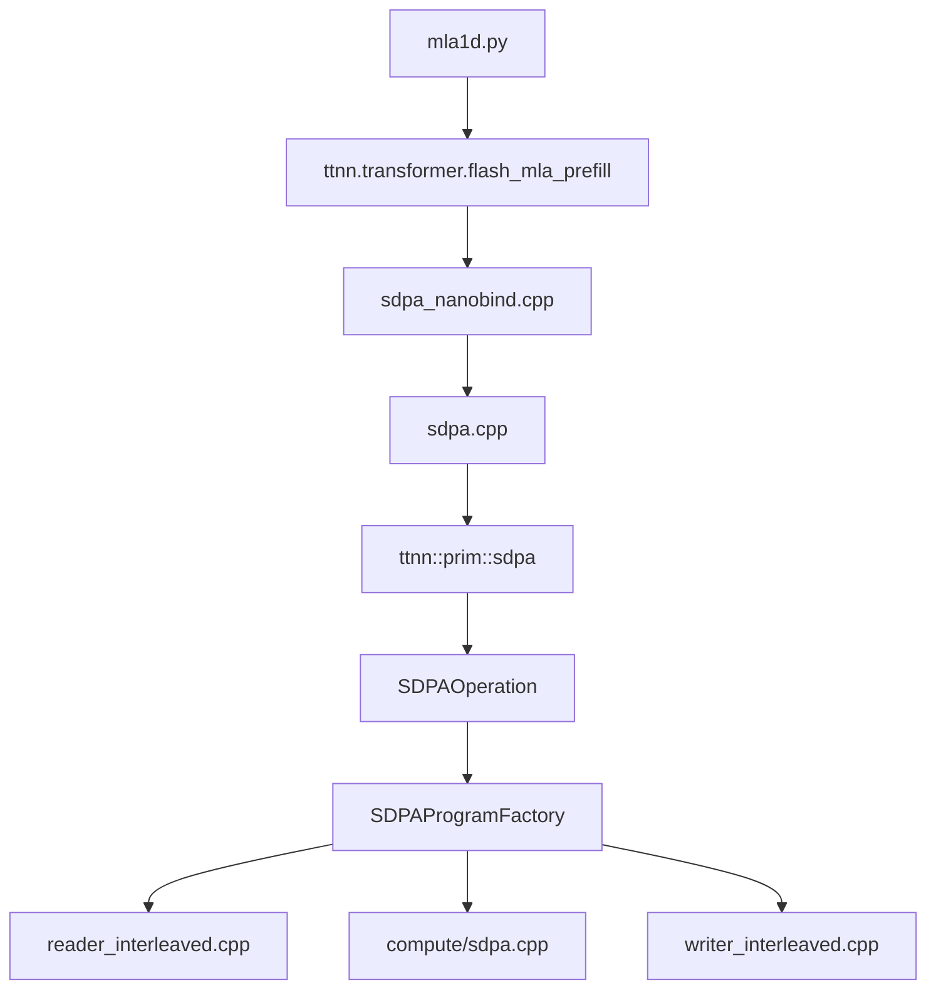

# Phase 1 Code Path Map

## 1. 文档目的

这份文档对应 `next-step-execution-plan.md` 里的 `Phase 1` 第一项，目标是把第一阶段主线涉及的代码路径固定下来。

这里聚焦的是当前已经冻结的主线：

**`single-chip non-causal prefill` 场景下，围绕 `MLA + Flash Attention` 的 `KV forwarding / multicast / layout / pipeline / NoC` 系统优化。**

因此，这份代码路径图主要回答下面几个问题：

1. 模型层是如何进入 TTNN attention/MLA op 的
2. `flash_mla_prefill` 与标准 SDPA 在实现上如何汇合
3. host 侧哪个文件负责 validate、program 组装和 runtime args 注入
4. device 侧 reader / compute / writer 各自负责什么
5. 如果后续做 `Experiment D`，最先应该改哪些文件

---

## 2. 一句话主路径

当前第一阶段最关键的主路径可以先记成一句话：

**`models/demos/deepseek_v3/tt/mla/mla1d.py` 调用 `ttnn.transformer.flash_mla_prefill`，该接口在 `sdpa_nanobind.cpp` 绑定后进入 `sdpa.cpp`，最终统一落到 `ttnn::prim::sdpa`，再由 `SDPAOperation + SDPAProgramFactory` 生成 program，并下发到 `reader_interleaved.cpp`、`sdpa.cpp`、`writer_interleaved.cpp` 三个 kernel。**

---

## 3. 总体结构图

---

## 4. 主路径逐层说明

## 4.1 模型层入口

第一阶段应用层最重要的入口是：

- `models/demos/deepseek_v3/tt/mla/mla1d.py`
- `models/demos/deepseek_v3/tt/mla/mla2d.py`

其中 `mla1d.py` 已经直接调用：

- `ttnn.transformer.flash_mla_prefill`

这说明当前仓库里的 MLA prefill 并不是独立的专用栈，而是已经接到了 TTNN 的 transformer SDPA 家族之上。

对第一阶段来说，这意味着：

- 模型侧不需要重新发明一套 MLA attention 接口
- 重点是理解 `flash_mla_prefill` 如何在 host/device 侧复用现有 SDPA 框架

---

## 4.2 Python API / nanobind 层

关键文件：

- `ttnn/cpp/ttnn/operations/transformer/sdpa/sdpa_nanobind.cpp`

这里负责把 Python 侧接口暴露给 `ttnn.transformer.*`。

当前与第一阶段最相关的绑定包括：

- `scaled_dot_product_attention`
- `chunked_scaled_dot_product_attention`
- `flash_mla_prefill`
- `chunked_flash_mla_prefill`

这里最重要的结论是：

- `flash_mla_prefill` 在 Python 层只是一个绑定入口
- 真正的执行逻辑并不在这里
- 这个文件主要负责把 Python 参数整理后交给 C++ 公共接口

如果后续你只是想改：

- Python API 形态
- overload 形式
- 参数命名或文档说明

才优先改这一层。

否则第一阶段大多数优化都不应该从这里下手。

---

## 4.3 C++ public API 层

关键文件：

- `ttnn/cpp/ttnn/operations/transformer/sdpa/sdpa.cpp`

这是从 Python 绑定进入之后的第一层公共 C++ 接口。

### 4.3.1 标准 SDPA 路径

- `scaled_dot_product_attention(...)`
- `chunked_scaled_dot_product_attention(...)`

它们最终都会调用：

- `ttnn::prim::sdpa(...)`

只是参数不同，例如：

- 是否 `is_causal`
- 是否有 `page_table`
- 是否是 `chunked`
- 是否使用 `attention_sink`

### 4.3.2 MLA prefill 路径

与第一阶段最相关的是：

- `flash_mla_prefill(...)`
- `chunked_flash_mla_prefill(...)`

这两条路径的关键点是：

- 依然调用统一的 `ttnn::prim::sdpa(...)`
- 通过 `use_mla = true` 打开 MLA 分支
- 通过 `head_dim_v` 告诉底层输出头维
- 在 chunked MLA 场景下，`V` 可以是隐含的

所以这里的核心认知是：

**MLA prefill 不是绕开 SDPA 主线重新实现，而是复用 SDPA 主框架，通过 `use_mla` 等参数切到 MLA 语义。**

这对第一阶段很重要，因为这意味着：

- 你做 `KV forwarding / multicast / layout / pipeline / NoC` 优化时，主要改的是共享底层
- 优化结果既可以服务标准 SDPA，也可能服务 MLA prefill
- 但在实验叙事上，你可以把 MLA 作为主要应用案例

---

## 4.4 Primitive / device operation 层

关键文件：

- `ttnn/cpp/ttnn/operations/transformer/sdpa/device/sdpa_device_operation.hpp`
- `ttnn/cpp/ttnn/operations/transformer/sdpa/device/sdpa_device_operation.cpp`

这里定义了：

- `SDPAOperation`
- `ttnn::prim::sdpa(...)`

这一层的职责主要是：

### 4.4.1 输入和模式校验

包括：

- regular mode / chunked mode 的约束检查
- `is_causal` 与 mask 的兼容性
- `page_table`、`chunk_start_idx` 等参数约束
- padding 约束

### 4.4.2 输出 tensor spec 与输出 tensor 创建

也就是：

- 输出 shape
- 输出 memory config
- 输出 tensor 分配

### 4.4.3 program hash / performance model

这一层还负责：

- 程序缓存相关的 hash
- 性能模型入口

对第一阶段来说，这一层不是最常改的地方，但在下面场景会碰到：

- 新增设计空间 knob，导致 program cache key 变化
- 需要新增参数合法性检查
- 需要确认某种新配置能否进入同一条 program 路径

---

## 4.5 Program factory 层

关键文件：

- `ttnn/cpp/ttnn/operations/transformer/sdpa/device/sdpa_program_factory.cpp`

这是第一阶段最核心的 host 侧文件。

如果把主路径里最关键的一层只选一个文件，那就是这里。

### 4.5.1 这一层负责什么

它主要负责：

- 根据输入 shape 和 `program_config` 划分并行度
- 创建 circular buffers
- 创建 semaphores
- 构建 `KV chain forwarding` 拓扑
- 检查 multicast 资格
- 生成 compile-time args
- 生成 runtime args
- 创建 reader / compute / writer kernel

### 4.5.2 第一阶段最值得盯的功能点

#### 并行划分

这里决定：

- `batch_parallel_factor`
- `nh_parallel_factor`
- `q_parallel_factor`

也就是每个 core 负责哪一段：

- batch
- q heads
- q chunks

#### KV chain forwarding

这里会：

- 构建 `core_work`
- 生成 `core_chain_info`
- 为多核 head 建 chain
- 选择 injector
- 记录 `prev_physical / next_physical`
- 记录每个 core 的 `q_chunk_count`

#### multicast eligibility

这一层还会检查：

- 是否同行
- mcast 矩形里是否有 gap
- `q_chunk_count` 是否一致

只有全部满足时，才会真正把 chain 配成 mcast。

#### compile-time args / runtime args

这里负责把 host 侧分析结果注入到 device kernel，例如：

- semaphore id
- `mcast_enabled`
- 每个 core 的局部 batch/head/q 范围
- chain metadata
- `prev_physical` / `next_physical`
- `mcast_num_dests`
- `mcast_sender_wait`

### 4.5.3 对第一阶段的意义

如果后续做：

- `per-chain hybrid`
- `layout-aware mapping`
- `pipelined read/forward`
- `dual NoC`

最可能首先动到的 host 侧文件就是这里。

也就是说：

**`Experiment D` 的大部分“策略层”变化，第一落点都应该是 `sdpa_program_factory.cpp`。**

---

## 4.6 Device kernel 层

第一阶段主路径上的 device kernel 主要有三类：

- `reader_interleaved.cpp`
- `compute/sdpa.cpp`
- `writer_interleaved.cpp`

它们由同一个 program factory 组织起来，在每个 core 上形成 `reader / compute / writer` 的协同流水。

### 4.6.1 Reader kernel

关键文件：

- `ttnn/cpp/ttnn/operations/transformer/sdpa/device/kernels/dataflow/reader_interleaved.cpp`

reader 的职责包括：

- 读取 `Q / K / V / mask / page_table / attention_sink`
- 把输入搬到本地 L1 circular buffers
- 在 `non-causal` 场景下处理 `KV chain forwarding`
- 根据 compile-time args 和 runtime args 决定是否启用 mcast

这里最值得记住的点有三个：

#### 点 1：reader 同时承担“读”和“转发”

reader 不只是从 DRAM 读本地输入，还承担：

- L1 -> L1 forwarding
- mcast 地址生成
- semaphore 同步

所以第一阶段很多优化并不只是 program factory 的策略问题，最终还会落到 reader 的状态机和同步协议上。

#### 点 2：MLA 通过 `use_mla` 进入 reader

reader 里已经有：

- `use_mla`
- `mla_kv_overlap`

这意味着 MLA 在 device 侧不是完全透明的，它会影响：

- `K/V` 读取方式
- `V` 的 tile shape
- `skip_src_cols`

#### 点 3：KV forwarding 的核心同步就在这里

reader 负责解析：

- `is_chain_participant`
- `is_injector`
- `is_sink`
- `prev_physical_x/y`
- `next_physical_x/y`
- `mcast_num_dests`
- `mcast_sender_wait`

以及：

- `sender_semaphore`
- `receiver_semaphore`
- `valid_semaphore`

所以如果后续你要做：

- `hybrid`
- `pipelined read/forward`
- `dual NoC`

reader 基本一定会被改。

### 4.6.2 Compute kernel

关键文件：

- `ttnn/cpp/ttnn/operations/transformer/sdpa/device/kernels/compute/sdpa.cpp`

compute 的职责是：

- 执行主 SDPA/FlashAttention 风格计算
- 消费 reader 放进来的 `Q/K/V/mask`
- 维护在线 softmax 相关中间状态
- 生成最终输出到输出 CB

这里的重点不是通信，而是：

- `sdpa_standard`
- `sdpa_standard_v2`
- 各类 CB 的消费与产生关系
- chunked / causal / mask 等模式切换

对第一阶段来说，compute 通常不是第一批策略优化的主要改动点。  
除非你后面要做：

- 更深的 fusion
- MLA latent-space 特化 compute
- compute 与 forwarding 的更强 overlap

否则第一阶段更可能是“少量配合修改”，而不是“从 compute 开始大改”。

### 4.6.3 Writer kernel

关键文件：

- `ttnn/cpp/ttnn/operations/transformer/sdpa/device/kernels/dataflow/writer_interleaved.cpp`

writer 的职责主要是：

- 生成隐式 mask 或 lightweight mask
- 等待 compute 产出输出块
- 把输出块写回 output tensor

对第一阶段来说，writer 主要是：

- 帮你理解 mask 生成路径
- 帮你理解 chunked offset / output writeback

通常不是 `KV forwarding` 优化的第一改动点。

---

## 5. 主路径和分支路径的区别

为了避免后续阅读时混淆，下面把第一阶段最相关的几条路径拆开说明。

## 5.1 标准 prefill SDPA

路径：

- `ttnn.transformer.scaled_dot_product_attention`
- `sdpa_nanobind.cpp`
- `sdpa.cpp`
- `ttnn::prim::sdpa`
- `SDPAOperation`
- `SDPAProgramFactory`
- `reader / compute / writer`

特点：

- `use_mla = false`
- `Q/K/V` 都显式提供

## 5.2 MLA prefill

路径：

- `ttnn.transformer.flash_mla_prefill`
- `sdpa_nanobind.cpp`
- `sdpa.cpp`
- `ttnn::prim::sdpa`
- `SDPAOperation`
- `SDPAProgramFactory`
- `reader / compute / writer`

特点：

- `use_mla = true`
- 仍然复用 SDPA 主框架
- `head_dim_v` 决定输出头维
- 部分场景中 `V` 可以由 `K` 隐含或复用

## 5.3 Chunked / paged prefill

路径仍然共享主框架，但会多出：

- `page_table`
- `chunk_start_idx` 或 `chunk_start_idx_tensor`

这条路径与第一阶段的关系是：

- 它更适合长上下文和 paged cache
- 但当前第一阶段主线不是先做 chunked/paged 的优化
- 可以作为后续扩展或对照

## 5.4 Decode

decode 不是这份代码路径图的主线。

它主要走：

- `ttnn/cpp/ttnn/operations/transformer/sdpa_decode/`
- `sdpa_decode.cpp`
- `sdpa_decode_program_factory.cpp`
- `sdpa_flash_decode.cpp`

在第一阶段，decode 只需要知道：

- 它是相关路径
- 它的通信组织更接近归约型
- 但暂时不作为主优化主线

---

## 6. Phase 1 下的文件优先级

为了方便后续做 `Experiment D`，可以把文件优先级按下面这样记住。

## 6.1 第一优先级

这些文件最可能最先被改：

- `ttnn/cpp/ttnn/operations/transformer/sdpa/device/sdpa_program_factory.cpp`
- `ttnn/cpp/ttnn/operations/transformer/sdpa/device/kernels/dataflow/reader_interleaved.cpp`

原因：

- 前者决定策略、布局、拓扑、runtime args
- 后者执行 forwarding、mcast 和同步协议

## 6.2 第二优先级

- `ttnn/cpp/ttnn/operations/transformer/sdpa/device/kernels/dataflow/writer_interleaved.cpp`
- `ttnn/cpp/ttnn/operations/transformer/sdpa/device/kernels/compute/sdpa.cpp`

原因：

- 如果优化影响 mask、writeback 或 compute overlap，才会更多改这里

## 6.3 第三优先级

- `ttnn/cpp/ttnn/operations/transformer/sdpa/sdpa.cpp`
- `ttnn/cpp/ttnn/operations/transformer/sdpa/sdpa_nanobind.cpp`
- `ttnn/cpp/ttnn/operations/transformer/sdpa/device/sdpa_device_operation.cpp`

原因：

- 更多是接口、参数、合法性和模式组织层
- 通常不是第一批性能优化的主战场

---

## 7. 第一批测试入口

这份代码路径图对应的第一批测试入口先固定为：

- `tests/ttnn/unit_tests/operations/sdpa/test_mla_prefill.py`
- `tests/ttnn/unit_tests/operations/sdpa/test_mla_decode.py`
- `tests/ttnn/unit_tests/operations/sdpa/test_mla_prefill_v_embedding_space.py`

它们的作用分别是：

- `test_mla_prefill.py`
  - 对齐 MLA prefill 主路径
- `test_mla_decode.py`
  - 保留 decode 相关验证入口
- `test_mla_prefill_v_embedding_space.py`
  - 验证 MLA 在 latent space / embedding space 两种实现路径上的一致性

---

## 8. 对 Experiment D 的直接意义

如果后续开始做 `Experiment D`，这份代码路径图给出的直接操作建议是：

### 8.1 `per-chain hybrid`

优先看：

- `sdpa_program_factory.cpp`
- `reader_interleaved.cpp`

### 8.2 `layout-aware mapping`

优先看：

- `sdpa_program_factory.cpp`

### 8.3 `pipelined read/forward`

优先看：

- `reader_interleaved.cpp`
- `sdpa_program_factory.cpp`

### 8.4 `dual NoC`

优先看：

- `reader_interleaved.cpp`
- `sdpa_program_factory.cpp`

### 8.5 `rotating injector / tree forwarding`

先不作为第一批必须项，但如果后续进入第二阶段，仍然是：

- 先改 `sdpa_program_factory.cpp`
- 再改 `reader_interleaved.cpp`

---

## 9. 当前结论

到这里可以把第一阶段主线的代码结构压缩成下面几句话：

1. `MLA prefill` 不是独立 attention 栈，而是复用 `SDPA` 主框架，并通过 `use_mla` 等参数切到 MLA 语义。
2. 第一阶段最关键的 host 文件是 `sdpa_program_factory.cpp`。
3. 第一阶段最关键的 device 文件是 `reader_interleaved.cpp`。
4. `compute/sdpa.cpp` 和 `writer_interleaved.cpp` 重要，但通常不是第一批通信策略优化的主入口。
5. 如果目标是推进 `Experiment D`，应优先围绕 `program factory + reader` 形成第一批修改计划。

---

## 10. 下一步

在这份代码路径图基础上，下一步最自然的是：

- 固定 `Experiment D` 的 `B0 -> B4` 执行顺序

也就是把下面四个优化项真正拆成实验计划：

- `per-chain hybrid`
- `layout-aware mapping`
- `pipelined read/forward`
- `dual NoC`
