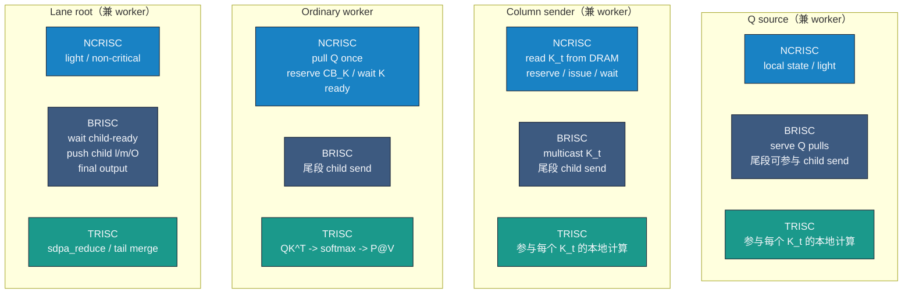

# Decode Lane/Column Roles 基础框图记录

## 目的
- 先把当前已经确认的 `Q / K / reduction` 数据流关系压成基础框图。
- 作为后续两张泳道图的统一语义底稿：一张理论版，一张实际版。
- 这里记录的是 `logical steady-state`，不是逐核逐指令时间戳 trace。

## 当前已经确认的约束
- `Q` 路径不是 `DRAM read + multicast`。更准确地说，每个 lane 的 `Q source / output-core` 在本地 `L1` 持有该 lane 的 `Q shard`，lane 内其他 worker 从该 source 的本地 `L1` 发起 `pull`。
- `K` 路径是 `Column sender / NCRISC` 从 `DRAM / paged KV cache` 流式读取 `K_t`，然后由 `Column sender / BRISC` 沿 column group 做 `multicast`，最后由所有 worker 的 `TRISC` 消费当前 `K_t` 做 `QK^T -> online softmax -> P@V`。
- `V` 不走单独 staging 路径，而是从同一个 `K` buffer 的前 `d_v` 列视图直接消费。
- `reduction` 的主链路不是 `Lane root / NCRISC`。更准确地说，非 root worker 的 `BRISC` 发送局部 `(m, l, O)`，root 侧 `BRISC` 等 `child-ready` 并把 child 的 `l / m / O` 推进到本地输入 CB，真正的 merge 算术由 root 侧 `TRISC` 执行，最终 output 再由 `BRISC` 写出或 gather。
- `Q source / Column sender / Lane root` 都是逻辑角色，不保证总是三个不同的物理 core；在实际布局里，它们可以和普通 worker 职责共置。

## 当前实际锚点（`decode_32k`）

| 指标 | 当前锚点 |
| --- | --- |
| kernel duration | `1112.09 us` |
| classification | `reader_writer_saturated` |
| reader reserve share | `57.58%` |
| K reserve share | `54.82%` |
| writer cb_wait share | `99.78%` |
| bubble wait-front share | `70.91%` |
| bubble reserve-back share | `29.09%` |
| sender / tree child wait | `49.95% / 50.05%` |
| root / output gather wait | `~0% / ~0%` |

这些锚点说明：当前实现的主要矛盾不是 `Q` 前段，也不是最后 output write，而是前段 `K reserve / wait_front` 与后段 `sender wait / tree_child_wait` 的双向耦合。

## 图 1：当前结果的阶段骨架

```mermaid
flowchart LR
    classDef q fill:#2ec4b6,stroke:#1c2433,color:#111722
    classDef k fill:#1982c4,stroke:#1c2433,color:#f5f7fb
    classDef comm fill:#3d5a80,stroke:#1c2433,color:#f5f7fb
    classDef compute fill:#1b998b,stroke:#1c2433,color:#f5f7fb
    classDef tail fill:#9b5de5,stroke:#1c2433,color:#f5f7fb
    classDef out fill:#00bbf9,stroke:#1c2433,color:#111722

    subgraph P0["阶段 0：Q preparation（只做一次）"]
        QS["Q source / output-core L1\n持有该 lane 的 Q shard"]:::q
        QP["lane 内 worker\npull Q -> cb_q_in"]:::q
        QS --> QP
    end

    subgraph P1["阶段 1：K-chunk steady-state loop（对每个 K_t 重复）"]
        KR["Column sender / NCRISC\nread K_t from DRAM -> local CB_K"]:::k
        KM["Column sender / BRISC\nmulticast K_t to column"]:::comm
        WR["worker reader path\nreserve CB_K slot + wait mcast-ready"]:::comm
        TC["all workers / TRISC\nQK^T -> online softmax -> P@V"]:::compute
        KR --> KM --> WR --> TC
        TC -. 下一块 K 与当前计算重叠 .-> KR
    end

    subgraph P2["阶段 2：Tree reduction + final output（全部 K_t 完成后）"]
        WS["non-root worker / BRISC\nsend local (m, l, O)"]:::tail
        RW["lane root / BRISC\nwait child-ready + push child l/m/O"]:::tail
        RT["lane root / TRISC\nsdpa_reduce / sdpa_tail merge"]:::compute
        OW["root / BRISC\nfinal output write / gather"]:::out
        WS --> RW --> RT --> OW
    end

    QP --> KR
    TC --> WS
```

## 图 2：当前结果的角色-处理器基础框图

## 后续两张泳道图必须保持的语义
- `Q` 统一画在前置阶段，语义是 `source L1 + per-worker pull`，不要再写成 `Q sender from DRAM + Q multicast`。
- `K` 统一画成主循环：`sender NCRISC read -> sender BRISC multicast -> all-worker TRISC compute`。
- `reduction` 统一画成尾段：`worker BRISC send -> root BRISC wait/push -> root TRISC merge -> root BRISC output`。
- 理论图和实际图必须使用相同的角色顺序、相同的处理器轨顺序、相同的颜色语义。
- 理论图只能表达“当前 dataflow 的理想重叠稳态”，不能偷偷换成另一种算法。
- 实际图只画已经有证据的等待：`K reserve`、`wait_front`、`reserve_back`、`sender wait`、`tree_child_wait`；不要凭感觉新增不存在的空泡。
