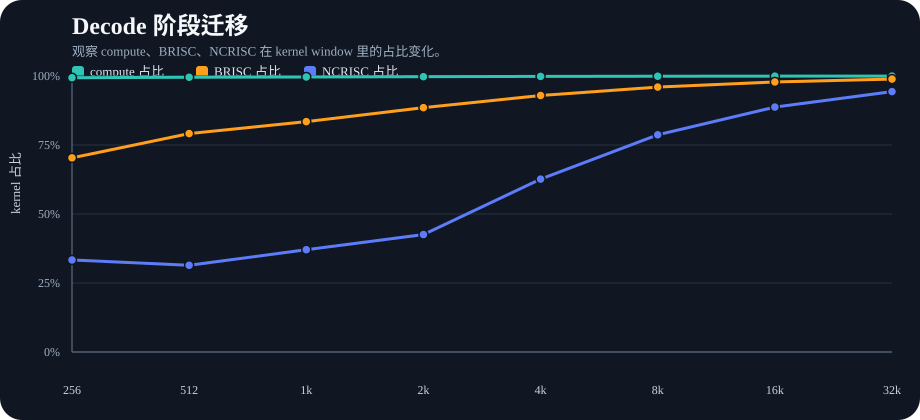
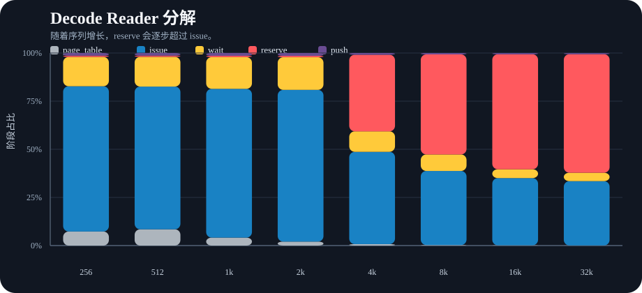
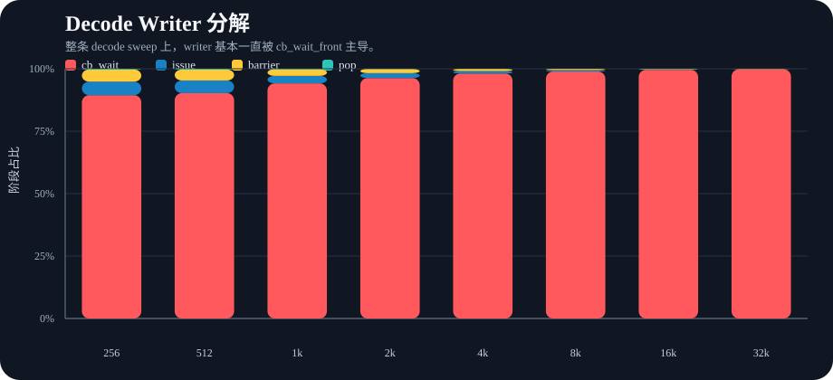
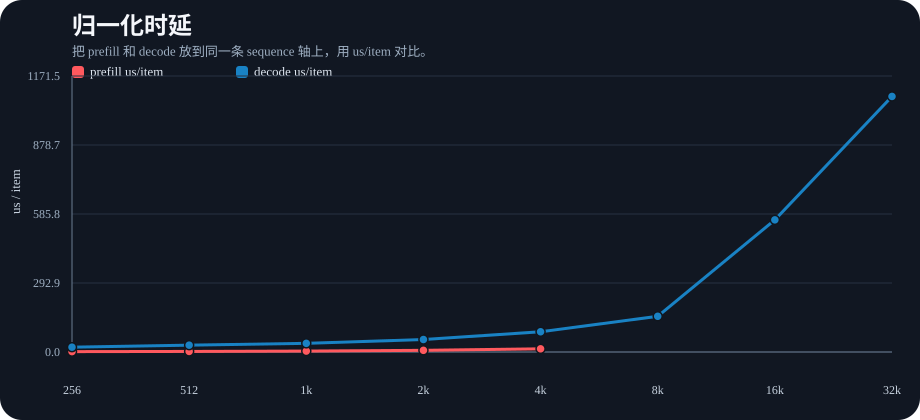
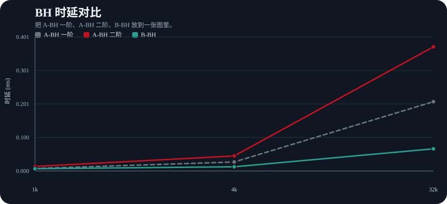
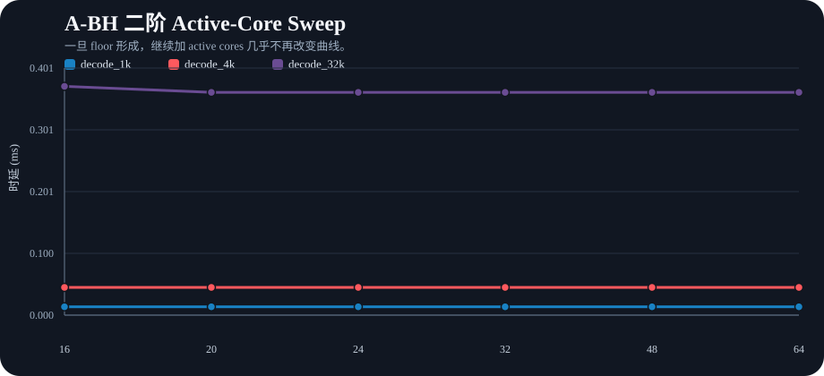

# FlashMLA Profile 可视化摘要

## 产物位置

- Dashboard：`flash_mla_visual_dashboard.html`
- 图表目录：`visuals/`

## 核心结论

- Decode 的 critical-path 迁移非常清楚：`256~1k` 仍然偏 compute-critical，`2k~8k` 转成 writer-close，`16k` 开始 reader-close，`32k` 则 reader 和 writer 一起饱和。
- Decode reader 的主导项从 `issue` 迁移到 `reserve`：`reserve share` 在 `1k` 是 `0.7%`，到 `4k` 变成 `39.8%`，到 `32k` 变成 `61.5%`。
- Decode writer 几乎始终被 `cb_wait_front` 主导：`cb_wait share` 从 `1k` 的 `94.1%` 上升到 `32k` 的 `99.8%`。
- `A-BH` 的二阶经验值已经明显 floor-dominated：`decode_1k=0.0135 ms`，`decode_4k=0.0450 ms`，`decode_32k=0.3715 ms`。
- 在 `32k` 点上，`B-BH=0.0663 ms`，相对经验二阶 `A-BH` 大约快 `5.6x`。

## 图表

### 1. Decode 阶段迁移

这张图最适合回答“什么时候不再只是 compute 在拖”：随着序列增长，`BRISC` 和 `NCRISC` 会逐渐把原来的 slack 吃掉。

### 2. Decode Reader 分解

这张图把 reader 的关键迁移直接画出来了：长序列 decode 不再主要由 `issue` 主导，而是越来越被 `reserve` 主导，也就是 backpressure 信号。

### 3. Decode Writer 分解

Writer 不是主要被 write issue 带宽限制，而是主要停在 `cb_wait`，所以更准确的表述是“强耦合流水线”，而不是“单纯写带宽瓶颈”。

### 4. Prefill vs Decode 归一化时延

这张图把两条路径放到了同一条 `us/item` 轴上。Prefill 的 per-item 曲线明显更重，而 decode 在更长序列前都相对平缓。

### 5. BH 模型对比

这张图把最关键的三条 BH 线放到一起：`A-BH 一阶`、`A-BH 二阶`、`B-BH`。

### 6. A-BH 二阶 Active-Core Sweep

这里最重要的观察是：一旦 floor 形成，继续增加 active cores 几乎不会继续缩短曲线。

## 备注

- 当前可视化基于现有的 WH detailed JSON 和 simple WH/BH simulation JSON。
- 新接入的 source-level marker，例如 `K/V reserve` 和 `sender/root/tree/output` wait，要在下一次重跑 detailed sweep 后才会真正出现在图里。
